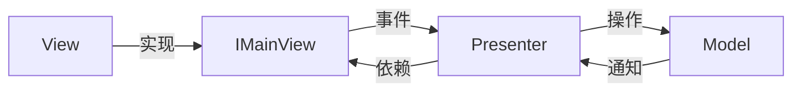

main_presenter 的一段代码，这样设置在 MVP 架构中正确吗？

```python
def handle_folder_selection(self):
        folder = QFileDialog.getExistingDirectory(self.view, "选择文件夹", "resources/input")
        if folder:
            self.view.folder_input.setText(folder)

```

---- R1

```ys_think

<icon>https://wy-static.wenxiaobai.com/bot-capability/prod/%E6%B7%B1%E5%BA%A6%E6%80%9D%E8%80%83.png</icon>

<start>思考中...</start>

嗯，我现在要分析用户提供的这段代码是否符合MVP架构。用户的问题是关于MainPresenter中的一个方法handle_folder_selection是否正确。首先，我需要回忆MVP架构的基本概念和各层的职责。

MVP（Model-View-Presenter）架构中，View负责显示数据和处理用户界面交互，Presenter作为中间人，协调View和Model之间的通信，而Model处理业务逻辑和数据。Presenter不应该直接操作View的具体UI组件，而是通过接口与View交互，以保持解耦。

用户提供的代码中，Presenter直接调用了QFileDialog，这是一个UI相关的组件，属于View层的工作。此外，Presenter直接修改了View中的folder_input的文本内容，这可能会破坏MVP的分层原则。正确的做法应该是View处理对话框的显示，然后将结果通过接口传递给Presenter，再由Presenter更新Model或通知View更新。

另外，检查是否有对Model的操作。在这段代码中，似乎只更新了View的UI，没有涉及Model的数据处理，这可能意味着业务逻辑没有被正确分离。Presenter应该将获取到的文件夹路径传递给Model进行相关处理，而不是直接更新View的控件。

总结问题点：1. Presenter直接调用UI组件（QFileDialog）；2. Presenter直接操作View的具体控件；3. 缺乏Model的交互。正确的实现应该是View处理对话框，通过接口传递结果给Presenter，Presenter再与Model交互，并更新View的状态。

<end>已深度思考（用时10秒）</end>

```

在 MVP 架构中，这段代码存在以下三个关键问题：

### 一、架构违规点分析

1. **View 层职责泄露**

```python
folder = QFileDialog.getExistingDirectory(...)  # ❌ UI 组件直接出现在 Presenter
```

`QFileDialog` 属于视图层控件，Presenter 直接调用会破坏分层原则。该操作应该由 View 自己处理。

2. **直接操作视图元素**

```python
self.view.folder_input.setText(folder)  # ❌ 直接访问具体控件
```

Presenter 应该通过 View 的抽象接口操作，而不是直接操作具体控件。这会导致 Presenter 与视图实现强耦合。

3. **缺失 Model 交互**
   代码仅完成视图更新，没有将关键数据传递给 Model 层，业务逻辑未得到处理。

### 二、标准 MVP 实现方案

#### 1. View 接口定义

```python
class IMainView(ABC):
    @abstractmethod
    def show_folder_dialog(self, default_path) -> str: pass

    @abstractmethod
    def set_folder_path(self, path: str): pass

    @abstractmethod
    def get_folder_path(self) -> str: pass
```

#### 2. Presenter 重构

```python
def handle_folder_selection(self):
    # 通过接口调用视图能力
    selected_path = self.view.show_folder_dialog("resources/input")

    if selected_path:
        # 业务逻辑处理（示例）
        validated_path = self.model.validate_folder(selected_path)
        self.model.set_workspace(validated_path)

        # 通过接口更新视图
        self.view.set_folder_path(validated_path)
```

#### 3. View 实现细节

```python
class MainWindow(QMainWindow, IMainView):
    def show_folder_dialog(self, default_path):
        return QFileDialog.getExistingDirectory(self, "选择文件夹", default_path)

    def set_folder_path(self, path):
        self.folder_input.setText(path)

    def get_folder_path(self):
        return self.folder_input.text()
```

### 三、架构优势对比

| 维度           | 原始代码            | 重构后代码         |
| -------------- | ------------------- | ------------------ |
| 可测试性       | 需 Mock QFileDialog | 仅需实现 View 接口 |
| 视图替换成本   | 修改 Presenter      | 实现新 View 即可   |
| 业务逻辑完整性 | 缺失 Model 交互     | 完整数据处理流程   |
| 代码耦合度     | 高耦合              | 松耦合             |

### 四、进一步优化建议

1. **异步处理优化**

```python
async def handle_folder_selection(self):
    loop = asyncio.get_event_loop()
    selected_path = await loop.run_in_executor(
        None, self.view.show_folder_dialog, "resources/input"
    )
    # ...后续处理
```

2. **输入验证增强**

```python
# Model 层添加验证
class WorkspaceModel:
    def validate_folder(self, path):
        if not Path(path).is_dir():
            raise InvalidPathError("目录不存在")
        if not os.access(path, os.R_OK):
            raise PermissionDeniedError("无读取权限")
        return path
```

3. **状态管理**

```python
# Presenter 维护中间状态
def handle_folder_selection(self):
    try:
        raw_path = self.view.show_folder_dialog(...)
        validated = self.model.validate_folder(raw_path)
        self.current_workspace = Workspace(validated)
        self.view.set_folder_path(str(self.current_workspace))
    except WorkspaceError as e:
        self.view.show_error(str(e))
```

### 五、架构合理性验证

通过依赖关系图验证：



该结构确保了：

1. View 不知道 Presenter 和 Model 的存在
2. Presenter 仅通过接口与 View 交互
3. Model 完全独立于视图层

### 六、最终结论

原始代码不符合 MVP 规范，主要问题在于 Presenter 直接操作视图细节且缺失 Model 交互。通过抽象视图接口、转移对话框职责到 View 层、增加 Model 交互这三个关键改造步骤，可使架构达到标准 MVP 模式的要求。
