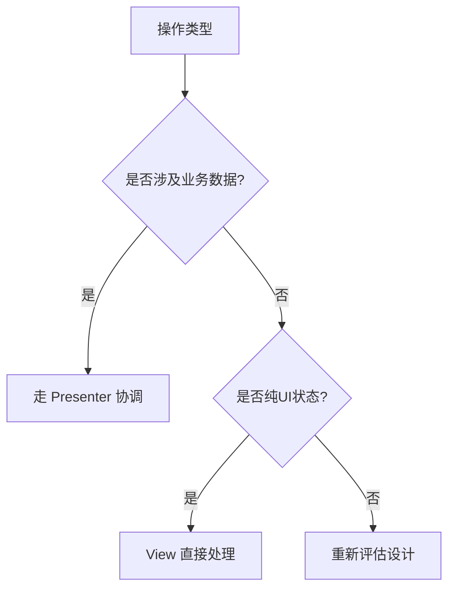
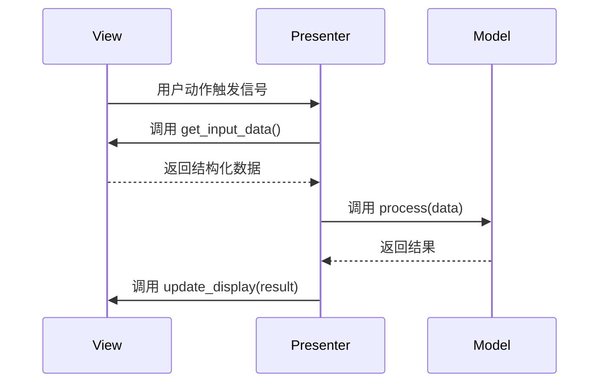

如果视图本身直接能处理，而不需要和 Model 交互数据，是不是直接在视图上写，而由 presenter 来调用它本身的接口了？但如果 Model 需要 view 中组件的内容，是不是还是得将接口暴露出来？这样做面对什么场景会有好处？
---- R1

```ys_think

<icon>https://wy-static.wenxiaobai.com/bot-capability/prod/%E6%B7%B1%E5%BA%A6%E6%80%9D%E8%80%83.png</icon>

<start>思考中...</start>

嗯，用户的问题是关于MVP架构中视图（View）、展示器（Presenter）和模型（Model）之间的交互。他们提到，如果视图本身能处理某些操作而不需要与Model交互，那是否应该直接在视图中处理，而Presenter只是调用视图的接口？但另一方面，如果Model需要视图中的组件内容，是否需要将接口暴露出来？这样做在什么场景下会有好处？

首先，我需要回忆MVP架构的基本原则。MVP中，View负责显示数据和接收用户输入，Presenter作为中间人处理业务逻辑，协调View和Model之间的交互，而Model则负责数据和业务规则。View应该尽可能被动，只负责UI相关的操作，不包含业务逻辑。

用户的问题涉及两种情况：一种是视图独立处理某些操作，不需要Model参与；另一种是Model需要访问视图的数据。这时候，应该如何设计接口，以及这样的设计在哪些情况下更有优势。

对于第一种情况，如果视图能自己处理某些操作，例如输入验证、本地状态管理（比如切换UI元素的可见性），那么确实可以直接在视图中处理，Presenter通过接口调用这些操作。这样做的好处是减少了Presenter的负担，保持其专注于核心业务逻辑，同时视图保持了一定的自治性。

但用户提到的第二种情况，当Model需要访问视图中的数据时，是否需要通过Presenter暴露接口。根据MVP的原则，Model不应该直接与View交互，而是通过Presenter中转。也就是说，View通过接口将数据传递给Presenter，Presenter再处理并更新Model。这种方式确保了各层的分离，避免了View和Model之间的直接依赖，提高代码的可维护性和可测试性。

举个例子，假设有一个表单提交功能，用户在视图中填写数据，点击提交按钮。这时候，View捕获点击事件，通知Presenter。Presenter从View接口获取输入数据，进行验证和处理，然后调用Model保存数据。Model不直接访问View的组件，而是通过Presenter传递数据。这种方式下，Model不需要知道View的具体实现，只需关注数据本身。

用户可能担心，如果View需要暴露太多接口，是否会增加复杂度。但通过合理设计接口，只暴露必要的方法，可以保持代码的整洁。例如，View接口可以定义getUsername()、getPassword()等方法，而不是直接暴露内部的输入框组件。这样Presenter只需调用这些接口方法获取数据，而不关心具体实现。

这样做的好处在于，当需要修改UI组件时，只需调整View的实现，而Presenter和Model不受影响。例如，将文本框改为下拉框，只需更新View的getUsername()实现，其他层不需要改动。这符合开闭原则，提高了系统的扩展性。

此外，这样的设计便于单元测试。Presenter可以依赖模拟的View接口进行测试，无需实际UI组件，测试更加简单可靠。同时，Model也可以独立测试，不涉及UI逻辑。

不过，用户可能存在的疑问是，如果某些操作确实只涉及视图内部状态，例如切换面板的展开/折叠，是否需要通过Presenter。在这种情况下，如果切换操作不影响业务逻辑，只是UI表现，可以直接在视图中处理，无需Presenter参与。但如果展开状态需要持久化或影响其他业务逻辑，则应由Presenter处理，确保状态同步到Model。

总结来说，MVP架构的关键在于职责分离，View处理UI，Presenter协调，Model管理数据。通过接口暴露必要的数据和方法，保持各层的独立，提高代码的可维护性、可测试性和扩展性。在面对不同场景时，根据操作是否涉及业务逻辑来决定处理方式，确保架构的清晰和灵活。

<end>已深度思考（用时23秒）</end>

```

在 MVP 架构中处理这类问题的核心原则是 **职责隔离** 和 **单向数据流**。以下是分层解决方案：

### 一、决策流程图



### 二、场景分类及处理方案

#### 场景 1：无需 Model 交互的纯 UI 操作

```python
# View 内部直接实现
class UserProfileView(IView):
    def toggle_advanced_options(self):
        """切换高级选项面板的显示状态"""
        self.advanced_panel.setVisible(not self.advanced_panel.isVisible())

    def _on_theme_changed(self):
        """更换主题色"""
        self.setStyleSheet("background: #F0F0F0;")
```

**优势**：

- 响应速度更快（无需跨层通信）
- 减少 Presenter 的复杂度
- 符合单一职责原则

#### 场景 2：需要 Model 数据的业务操作

```python
# Presenter 协调流程
class UserProfilePresenter:
    def save_profile(self):
        # 通过接口获取视图数据
        user_data = self.view.get_user_input()

        # 执行业务验证
        if not self.model.validate(user_data):
            self.view.show_error("输入数据不合法")
            return

        # 更新模型
        try:
            self.model.save(user_data)
            self.view.show_success()
        except DBError as e:
            self.view.show_error(str(e))
```

**接口设计**：

```python
class IUserProfileView(ABC):
    @abstractmethod
    def get_user_input(self) -> dict: ...

    @abstractmethod
    def show_error(self, msg: str): ...

    @abstractmethod
    def show_success(self): ...
```

### 三、数据流向控制



### 四、接口暴露的收益场景

#### 1. 多视图适配

```python
# 桌面端视图实现
class DesktopUserView(IUserView):
    def get_input_data(self):
        return {
            'name': self.name_input.text(),
            'age': self.age_spinbox.value()
        }

# Web端视图实现
class WebUserView(IUserView):
    def get_input_data(self):
        return parse_json(self._fetch_form_data())
```

**优势**：同一 Presenter 可支持不同技术栈的视图实现

#### 2. 测试便利性

```python
# 模拟视图测试
class MockUserView(IUserView):
    def get_input_data(self):
        return {"name": "测试用户", "age": 25}

def test_save_profile():
    presenter = UserPresenter(MockUserView(), TestModel())
    presenter.save_profile()
    assert TestModel.saved_data is not None
```

**优势**：无需启动真实 UI 即可测试业务逻辑

#### 3. 状态同步保障

```python
# Presenter 维护一致性
def on_data_updated(self):
    latest_data = self.model.fetch_latest()
    self.view.update_display(latest_data)
    self.view.enable_edit(not self.model.is_locked)
```

**优势**：避免视图直接修改模型导致状态不一致

### 五、反模式警示

#### ❌ 错误案例 1：视图直接操作模型

```python
class BadView:
    def save_clicked(self):
        # 直接操作模型层
        Database.save(self.input.text())  # 违反分层原则
```

**后果**：

- 业务逻辑与视图强耦合
- 无法复用视图组件
- 测试必须依赖真实数据库

#### ❌ 错误案例 2：模型包含视图逻辑

```python
class BadModel:
    def render_user_avatar(self):
        # 包含UI渲染细节
        return f"<div class='avatar'>{self.name}</div>"  # 应属于视图职责
```

**后果**：

- 模型无法用于非 GUI 场景（如 API 服务）
- 修改样式需要修改模型代码

### 六、最佳实践总结

1. **接口最小化原则**  
   视图接口只暴露必需的操作方法，例如：

   ```python
   class IReportView(ABC):
       @abstractmethod
       def get_date_range(self) -> tuple: ...

       @abstractmethod
       def show_report(self, data: list): ...

       @abstractmethod
       def show_loading(self, is_loading: bool): ...
   ```

2. **数据转换前置**  
   在 Presenter 中完成数据格式化：

   ```python
   def export_data(self):
       raw = self.view.get_export_params()
       # 统一转换逻辑
       return {
           'start': datetime.fromisoformat(raw['start']),
           'end': datetime.fromisoformat(raw['end'])
       }
   ```

3. **状态同步机制**  
   使用观察者模式维护一致性：

   ```python
   class Presenter:
       def __init__(self):
           self._data_observers = []

       def add_data_observer(self, callback):
           self._data_observers.append(callback)

       def _notify_observers(self):
           for cb in self._data_observers:
               cb(self.current_data)
   ```

4. **性能敏感操作豁免**  
   对高频操作（如实时绘图）允许有限度的直接访问：
   ```python
   class HighPerfView:
       def realtime_plot(self, points):
           # 直接操作Canvas提升性能
           self.canvas.draw_points(points)  # 仍需保持无业务逻辑
   ```

通过以上规范，可实现：

- 视图修改不影响业务层
- 业务逻辑可独立测试
- 支持多类型视图适配
- 保持各层的技术栈独立性
