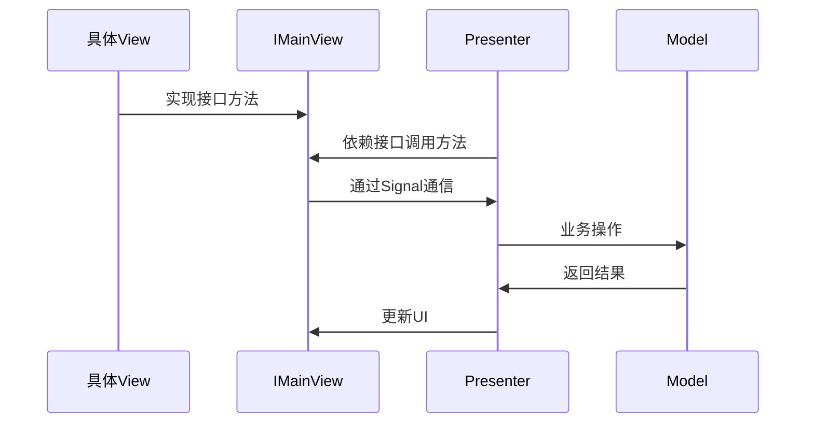

以下代码我是应该放在 view 层还是放在 presenter 层？

```python
class IMainView(QObject):
    generate_triggered = Signal(int)
    folder_selected = Signal(str)
    toggle_topmost = Signal(bool)
    menu_clicked = Signal(str)

    def set_folder_path(self, path: str) -> None: ...
    def get_watermark_params(self) -> Dict[str, Any]: ...
    def show_error(self, message: str) -> None: ...
    def set_window_topmost(self, is_topmost: bool) -> None: ...
```

---R1

```ys_think

<icon>https://wy-static.wenxiaobai.com/bot-capability/prod/%E6%B7%B1%E5%BA%A6%E6%80%9D%E8%80%83.png</icon>

<start>思考中...</start>

好的，我需要确定将`IMainView`接口类放在MVP架构中的视图层还是表示层。首先，我应该回顾一下MVP的基本结构，了解各层的职责。

在MVP模式中，视图（View）负责显示数据和接收用户输入，但不处理业务逻辑。表示器（Presenter）作为中间人，处理视图的输入事件，协调模型（Model）和视图之间的数据流。模型则负责数据和业务逻辑。

现在来看`IMainView`类的定义。它包含了一些信号（如`generate_triggered`、`folder_selected`等）和抽象方法（如`set_folder_path`、`get_watermark_params`等）。这些信号和方法看起来像是视图层需要实现的接口，用于与表示器通信。信号通常用于视图触发事件，而抽象方法则是表示器调用视图更新UI的方法。

根据MVP的分层原则，接口定义应该属于视图层，因为它们定义了视图需要实现的行为和事件。表示器依赖于这些接口来与视图交互，而不是具体的视图实现。这样可以实现松耦合，便于替换不同的视图实现。

可能存在的疑问是：接口是否应该放在表示层？但根据设计，接口属于视图的契约，表示器只是使用这些接口，并不实现它们。因此，`IMainView`应该属于视图层，作为视图组件必须遵循的协议。

总结：`IMainView`作为视图接口，属于视图层，确保视图组件的一致性和可替换性，同时表示器依赖该接口进行操作，符合MVP的设计原则。

<end>已深度思考（用时11秒）</end>

```

在 MVP 架构中，`IMainView` 接口的定位需要结合其功能和架构角色来判断。以下是分层决策的详细分析：

---

### **一、接口定义的正确归属**

#### 1. **架构定位**

```python
class IMainView(QObject):
    # 信号定义（View触发事件）
    generate_triggered = Signal(int)
    folder_selected = Signal(str)
    toggle_topmost = Signal(bool)
    menu_clicked = Signal(str)

    # 视图操作契约（Presenter调用）
    def set_folder_path(self, path: str) -> None: ...
    def get_watermark_params(self) -> Dict[str, Any]: ...
    def show_error(self, message: str) -> None: ...
    def set_window_topmost(self, is_topmost: bool) -> None: ...
```

#### 2. **核心判断标准**

| 特征                 | 归属层  | 理由                       |
| -------------------- | ------- | -------------------------- |
| 信号定义 (Signal)    | View 层 | 信号是视图事件的发射机制   |
| 抽象方法 (Abstract)  | View 层 | 定义视图必须实现的操作能力 |
| 接口名称 (IMainView) | View 层 | 明确表示这是视图的契约接口 |

---

### **二、分层依据**

#### 1. **技术特性**

- **信号机制**：PySide 的信号系统本质属于视图层的用户交互响应机制
- **界面操作**：`set_folder_path` 等方法直接对应具体 UI 组件操作

#### 2. **架构原则**

- **依赖倒置原则**：Presenter 依赖抽象（IMainView），但接口本身属于视图层
- **单一职责原则**：视图接口仅描述视图能力，不涉及业务逻辑

#### 3. **代码组织**

```text
project/
├── view/
│   ├── interfaces.py   # IMainView 在此定义
│   └── main_window.py  # 实现 IMainView
├── presenter/
│   └── main_presenter.py # 依赖 IMainView
└── model/
```

---

### **三、错误归属的后果**

#### ❌ 错误放置于 Presenter 层

| 问题         | 影响                                               |
| ------------ | -------------------------------------------------- |
| 循环依赖     | Presenter 层定义视图接口，但 View 又依赖 Presenter |
| 架构混淆     | 破坏分层边界，Presenter 包含视图细节               |
| 可维护性下降 | 修改视图接口需要进入 Presenter 层                  |

#### ✅ 正确放置于 View 层

| 优势     | 收益                                     |
| -------- | ---------------------------------------- |
| 明确分层 | Presenter 仅使用接口，不定义接口         |
| 易扩展性 | 新增 WebView/MobileView 只需实现相同接口 |
| 测试隔离 | Mock 视图时只需关注 View 层接口          |

---

### **四、接口的跨层交互**



---

### **五、最佳实践示例**

#### 1. **View 层实现**

```python
# view/main_window.py
class MainWindow(QMainWindow, IMainView):
    generate_triggered = Signal(int)

    def __init__(self):
        super().__init__()
        self._init_ui()

    def set_folder_path(self, path: str):
        self.folder_input.setText(path)

    def _on_generate_click(self):
        self.generate_triggered.emit(self.combo.currentIndex())
```

#### 2. **Presenter 层使用**

```python
# presenter/main_presenter.py
class MainPresenter:
    def __init__(self, view: IMainView, model):
        self.view = view
        self.view.generate_triggered.connect(self.handle_generate)

    def handle_generate(self, index):
        params = self.view.get_watermark_params()
        # 调用Model处理...
```

---

### **六、结论**

`IMainView` 接口应严格归属于 **View 层**，因为：

1. **技术本质**：包含视图特有的信号机制和 UI 操作方法
2. **架构定位**：定义视图组件必须遵守的契约
3. **设计原则**：符合依赖倒置原则，Presenter 依赖抽象而不定义抽象

正确分层带来的收益：

- 清晰的代码边界
- 方便的视图替换（如实现终端视图、Web 视图）
- 提升单元测试便利性
- 增强核心业务逻辑的可移植性

通过将接口定义在 View 层，可以确保 MVP 架构的纯净性，为后续扩展维护奠定坚实基础。
