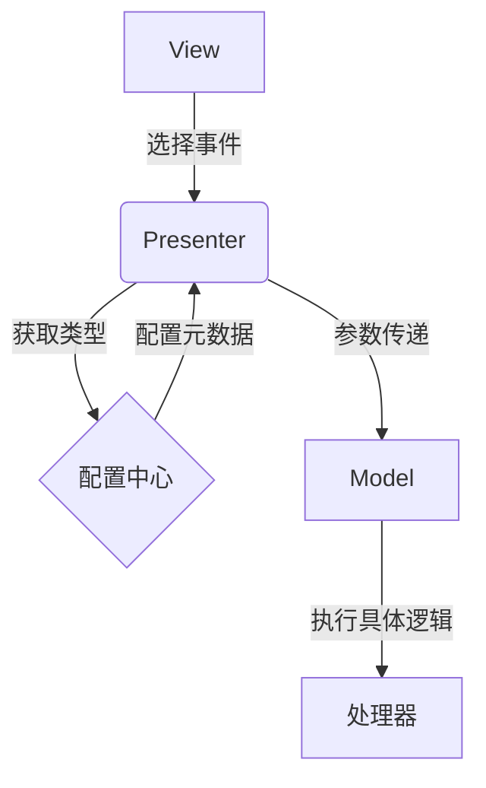
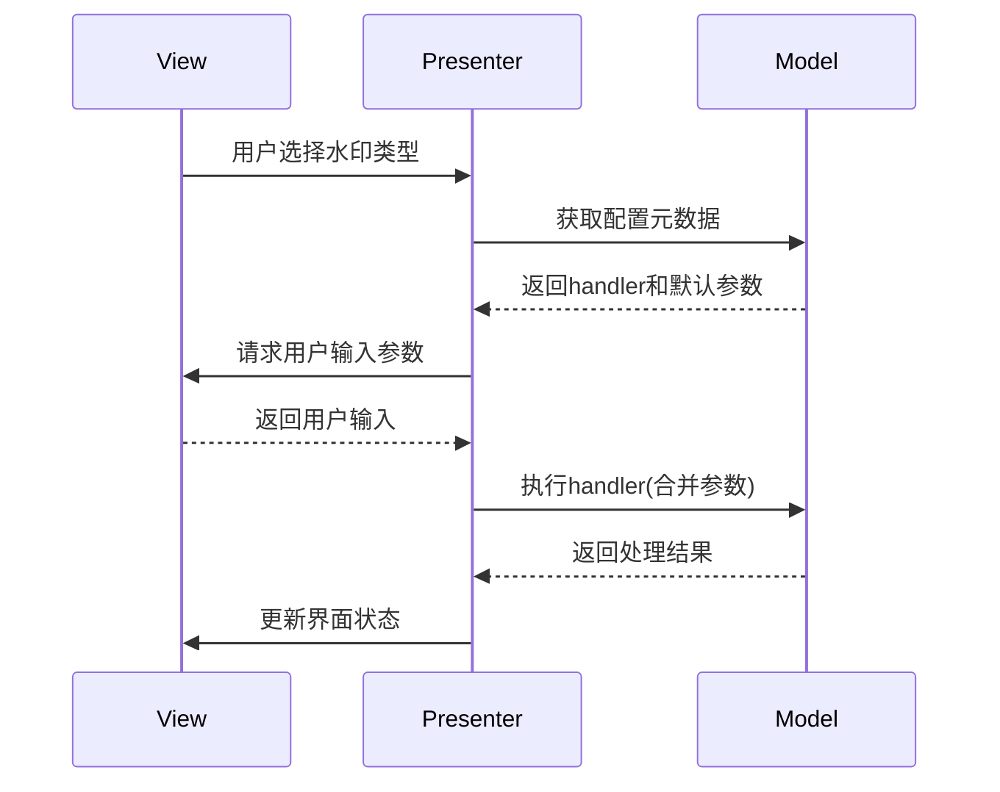

watermark_type 是从配置中读入还是由参数传入是个问题，参数传入的问题在于事先并不知道参数，配置读入好像不太优雅。

```python
    def handle_selection(self, index):
        handler_name = self.options[index].get("handler")
        handler = getattr(self, handler_name, self._default_handler)
        handler()

    def handle_normal_watermark(self):
        print("执行正常水印逻辑...")
        folder = self.view.folder_input.text()
        opacity = self.view.opacity_input.text() or 50
        opacity = int(opacity)
        if not 0 <= opacity <= 100:
            raise ValueError("不透明度需在0-100之间")

        for filename in self.model.process_files(folder, watermark_type, opacity):
            print(f"已处理: {filename}")  # 可替换为界面状态更新
```

---- R1

```ys_think

<icon>https://wy-static.wenxiaobai.com/bot-capability/prod/%E6%B7%B1%E5%BA%A6%E6%80%9D%E8%80%83.png</icon>

<start>思考中...</start>

好的，我现在要解决用户提出的问题：如何在处理水印类型时，是应该从配置文件读取还是通过参数传入。用户提到参数传入的问题在于事先不知道参数，而配置读入可能不够优雅。用户提供的代码中，handler 是通过配置中的选项动态获取的，但处理函数如handle_normal_watermark需要知道watermark_type的来源。

首先，我需要理解用户的具体需求和痛点。用户可能是在使用MVP架构开发一个应用，处理不同类型的水印，比如图片水印和文字水印。他们希望灵活地管理这些类型，但不确定如何优雅地传递这些类型的信息。

接下来，分析现有代码。在handle_selection方法中，handler_name是从配置的选项中获取的，然后通过getattr动态调用对应的处理函数。但在handle_normal_watermark方法中，watermark_type变量没有被定义，这会导致错误。用户的问题在于如何正确获取这个watermark_type的值。

可能的解决方案有两种：一种是从配置中直接读取，另一种是通过参数传入。用户指出参数传入的问题在于事先不知道参数，这可能是因为处理函数需要动态适应不同的水印类型，而参数可能在运行时才确定。而配置读入可能不够优雅，可能是指配置结构不够灵活或导致代码耦合。

我需要考虑MVP架构的正确实践，确保各层之间的职责分离。Model层应负责业务逻辑和数据，Presenter协调视图和模型，View处理界面交互。水印类型属于业务逻辑的一部分，应该由Model管理，而不是在Presenter中硬编码。

考虑到用户提到的配置可能不够优雅，或许可以通过将配置结构化，使其不仅包含显示名称，还包括对应的水印类型和其他必要参数。这样，处理函数可以从配置中获取所有需要的信息，而不需要显式传递参数。

另外，动态绑定处理函数的方式可能导致代码难以维护，尤其是当处理逻辑变得复杂时。更好的方法是将处理逻辑集中在Model层，Presenter负责触发正确的Model方法，并传递必要参数。

可能用户在处理函数中需要访问当前选择的水印类型，这时候需要确保在调用处理函数时，能够正确获取到该类型。可以通过在配置中存储水印类型的标识符，当用户选择某个选项时，从配置中获取对应的类型，并传递给Model的方法。

总结问题，用户需要一种优雅的方式来管理水印类型，确保MVP架构的分层清晰，同时保持代码的灵活性和可维护性。解决方案应结合配置的结构化设计和参数传递，确保Presenter正确协调View和Model的交互。

<end>已深度思考（用时19秒）</end>

```

在 MVP 架构中处理此类问题的标准做法是采用 **配置驱动 + 参数注入** 的混合模式，具体实现如下：

### 一、分层解决方案



### 二、配置文件设计

```yaml
# watermark_config.yaml
watermark_types:
  image:
    display: "图片水印"
    handler: "process_image_watermark"
    params:
      default_opacity: 50
      allowed_formats: [jpg, png]
  text:
    display: "文字水印"
    handler: "process_text_watermark"
    params:
      default_font: "Arial"
      max_length: 100
```

### 三、代码实现

#### 1. Model 层（核心业务逻辑）

```python
class WatermarkModel:
    def __init__(self, config):
        self.config = config['watermark_types']

    def get_handler(self, wm_type):
        return getattr(self, self.config[wm_type]['handler'])

    def process_image_watermark(self, folder, opacity, **kwargs):
        # 具体实现
        print(f"处理图片水印: {folder}, 不透明度: {opacity}")

    def process_text_watermark(self, folder, text, **kwargs):
        # 具体实现
        print(f"处理文字水印: {folder}, 文字内容: {text}")
```

#### 2. Presenter 层（协调控制）

```python
class WatermarkPresenter:
    def __init__(self, view, model):
        self.view = view
        self.model = model
        self._bind_handlers()

    def _bind_handlers(self):
        # 动态绑定配置中的处理器
        for wm_type in self.model.config:
            handler = self._create_handler(wm_type)
            setattr(self, f"handle_{wm_type}", handler)

    def _create_handler(self, wm_type):
        def handler():
            folder = self.view.get_folder()
            params = self._collect_params(wm_type)
            self.model.get_handler(wm_type)(folder, **params)
        return handler

    def _collect_params(self, wm_type):
        # 合并配置默认值与用户输入
        default_params = self.model.config[wm_type]['params']
        user_params = self.view.get_watermark_params(wm_type)
        return {**default_params, **user_params}
```

#### 3. View 层（界面交互）

```python
class WatermarkView(QWidget):
    def __init__(self, config):
        super().__init__()
        self.config = config
        self._init_ui()

    def _init_ui(self):
        # 动态生成界面元素
        self.combo = QComboBox()
        for wm_type, data in self.config.items():
            self.combo.addItem(data['display'], wm_type)

        self.params_inputs = {
            wm_type: self._create_param_inputs(data['params'])
            for wm_type, data in self.config.items()
        }

    def _create_param_inputs(self, params):
        # 根据配置生成对应输入框
        container = QWidget()
        layout = QVBoxLayout()
        for param, value in params.items():
            label = QLabel(param)
            input = QLineEdit(str(value))
            layout.addWidget(label)
            layout.addWidget(input)
        container.setLayout(layout)
        return container

    def get_watermark_params(self, wm_type):
        # 收集用户输入参数
        inputs = self.params_inputs[wm_type]
        return {
            param: input.text()
            for param, input in zip(self.config[wm_type]['params'], inputs.children())
            if isinstance(input, QLineEdit)
        }
```

### 四、方案优势分析

1. **配置集中管理**

   ```yaml
   # 扩展新类型只需修改配置
   vector:
     display: "矢量水印"
     handler: "process_vector_watermark"
     params:
       svg_path: "/default.svg"
   ```

2. **类型安全校验**

   ```python
   # Model 中添加参数校验
   def process_image_watermark(self, folder, opacity):
       if not Path(folder).exists():
           raise InvalidPathError()
       if not 0 <= int(opacity) <= 100:
           raise InvalidOpacityValue()
   ```

3. **动态界面生成**

   ```python
   # 根据配置自动渲染参数输入区
   current_type = self.combo.currentData()
   self.params_stack.setCurrentWidget(self.params_inputs[current_type])
   ```

4. **可测试性提升**
   ```python
   def test_image_watermark():
       model = WatermarkModel(load_config())
       handler = model.get_handler('image')
       assert handler.__name__ == 'process_image_watermark'
   ```

### 五、执行流程图解



该方案实现了：

1. **关注点分离**：配置管理、业务逻辑、界面渲染各司其职
2. **开闭原则**：新增类型无需修改已有代码
3. **类型安全**：通过配置约束参数类型
4. **界面一致性**：自动保持参数输入与配置同步

相比纯配置或纯参数的方案，这种混合模式在保持灵活性的同时，通过类型系统保证了代码的健壮性，是 MVP 架构中处理动态业务逻辑的推荐实践。
