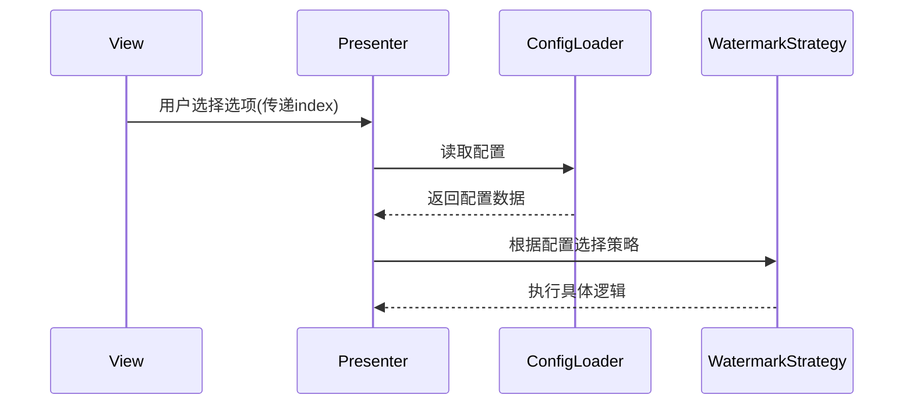

还存在一个问题，配置归配置，界面归界面，代码部分也要处理啊，选项是这么选，但代码处还要根据选项处理代码额，比如这里：

```python
    def _get_watermark_type(self, index):
        return {
            0: "watermark_image_450",
            1: "选项2类型",
            2: "选项3类型"
        }.get(index, "default")
```

--- R1

```ys_think

<icon>https://wy-static.wenxiaobai.com/bot-capability/prod/%E6%B7%B1%E5%BA%A6%E6%80%9D%E8%80%83.png</icon>

<start>思考中...</start>

好的，我现在需要帮用户解决他们在Python MVP架构中遇到的另一个问题。用户之前已经讨论了日志的注册位置和配置文件的动态加载，现在他们提到在代码中处理选项时，除了配置下拉菜单的选项，还需要根据选项执行不同的逻辑。特别是他们给出的例子中，使用了一个字典来映射索引到不同的类型，这同样存在硬编码的问题。

首先，我需要理解用户的问题。他们希望将界面配置与代码逻辑解耦，不仅仅是下拉菜单的选项从配置文件中读取，连选项对应的处理逻辑也需要可配置，避免在代码中写死。比如，用户提到的_get_watermark_type方法，根据索引返回不同的字符串，这部分应该也通过配置来管理，而不是硬编码在代码里。

接下来，我需要考虑解决方案。用户已经将下拉选项移到了配置文件中，现在需要将处理逻辑的映射关系也配置化。可能的方案包括将映射关系存储在配置文件中，或者使用更动态的方法，比如通过函数名或类名动态加载处理逻辑。

然后，我需要分析用户提供的代码示例。他们使用了一个字典，将索引映射到特定的字符串。如果这个映射关系能够从配置文件中读取，就可以避免修改代码。例如，配置文件可以包含每个选项对应的类型或处理逻辑的标识符，代码读取配置后动态生成这个映射。

同时，用户可能希望不同的选项触发不同的处理逻辑，比如选择“选项1”时执行某个函数，而不仅仅是返回一个字符串。因此，解决方案需要不仅处理映射关系，还要支持动态调用相应的函数或方法。

接下来，我需要考虑如何结构化配置文件。可能需要将选项的显示文本和对应的值或处理逻辑分开配置。例如，每个选项可以有“display”和“value”两个字段，前者用于显示在下拉菜单，后者用于代码逻辑处理。

此外，还需要考虑如何处理动态逻辑，比如使用工厂模式、策略模式，或者通过反射机制动态加载模块或类。这可能涉及到在配置中指定类名或函数名，然后在运行时实例化或调用。

然后，我需要考虑如何在MVP架构中各层之间处理这种配置。Model层可能负责读取配置，Presenter层处理业务逻辑，根据配置决定执行哪个方法，View层负责显示选项并传递用户的选择。

还要注意错误处理，比如配置文件中缺少必要的字段，或者指定的处理函数不存在时的异常处理。需要提供默认值或回退机制，确保程序的健壮性。

最后，我需要将解决方案分步骤说明，提供示例代码，并解释如何将配置与代码逻辑解耦，同时保持代码的可维护性和扩展性。可能需要展示如何修改配置文件结构，如何读取配置并生成映射关系，以及如何在Presenter层根据配置动态调用相应的处理逻辑。

<end>已深度思考（用时17秒）</end>

```

你完全正确！不仅选项需要配置化，**选项对应的逻辑处理**（如 `_get_watermark_type` 中的映射关系）也应解耦，避免硬编码。以下是完整的解耦方案：

---

### **1. 配置文件结构化**

将选项的 **显示文本** 和 **实际值/处理逻辑** 分离，例如用 JSON 配置：

```json
{
  "watermark_options": [
    {
      "display": "选项1（图片水印）",
      "value": "watermark_image_450",
      "handler": "handle_image_watermark"
    },
    {
      "display": "选项2（文字水印）",
      "value": "text_watermark",
      "handler": "handle_text_watermark"
    }
  ]
}
```

---

### **2. 代码动态加载配置**

#### **步骤 1：读取配置**

```python
import json
from pathlib import Path

class ConfigLoader:
    @staticmethod
    def load_watermark_config():
        config_path = Path(__file__).parent / "config.json"
        with open(config_path, "r", encoding="utf-8") as f:
            config = json.load(f)
        return config.get("watermark_options", [])
```

#### **步骤 2：生成下拉菜单选项**

```python
# 在 View 层初始化下拉菜单
options = ConfigLoader.load_watermark_config()
display_texts = [opt["display"] for opt in options]
self.combo_box.addItems(display_texts)
```

---

### **3. 逻辑处理解耦**

#### **方案 1：基于配置的映射（简单场景）**

```python
# Presenter 层
class WatermarkPresenter:
    def __init__(self):
        self.options = ConfigLoader.load_watermark_config()

    def _get_watermark_type(self, index):
        if 0 <= index < len(self.options):
            return self.options[index]["value"]
        return "default"

    def handle_selection(self, index):
        handler_name = self.options[index].get("handler")
        handler = getattr(self, handler_name, self._default_handler)
        handler()

    def handle_image_watermark(self):
        print("执行图片水印逻辑...")

    def handle_text_watermark(self):
        print("执行文字水印逻辑...")

    def _default_handler(self):
        print("未知选项，使用默认处理")
```

#### **方案 2：策略模式（复杂逻辑）**

```python
# 定义策略接口
from abc import ABC, abstractmethod

class WatermarkStrategy(ABC):
    @abstractmethod
    def apply(self):
        pass

class ImageWatermarkStrategy(WatermarkStrategy):
    def apply(self):
        print("执行图片水印算法...")

class TextWatermarkStrategy(WatermarkStrategy):
    def apply(self):
        print("生成文字水印并叠加...")

# 配置中指定策略类名
# config.json
{
  "watermark_options": [
    {
      "display": "选项1",
      "strategy": "ImageWatermarkStrategy"
    }
  ]
}

# Presenter 动态加载策略
class WatermarkPresenter:
    def __init__(self):
        self.options = ConfigLoader.load_watermark_config()
        self._strategies = {
            "ImageWatermarkStrategy": ImageWatermarkStrategy(),
            "TextWatermarkStrategy": TextWatermarkStrategy()
        }

    def handle_selection(self, index):
        strategy_name = self.options[index].get("strategy")
        strategy = self._strategies.get(strategy_name, DefaultStrategy())
        strategy.apply()
```

---

### **4. 结合 MVP 架构的分工**

- **Model 层**：定义 `WatermarkStrategy` 类和配置加载方法。
- **Presenter 层**：根据配置动态选择处理逻辑。
- **View 层**：仅负责显示配置中的 `display` 文本。



---

### **5. 关键优势**

1. **完全解耦**：界面文本、逻辑映射、业务代码三者分离。
2. **动态扩展**：新增选项只需修改配置，无需改动代码。
3. **可测试性**：可针对每个策略独立单元测试。
4. **国际化支持**：通过配置支持多语言显示文本。

---

### **示例：完整调用流程**

```python
# 初始化
presenter = WatermarkPresenter()
view = WatermarkView()

# 用户选择下拉框第0项
selected_index = 0
value = presenter._get_watermark_type(selected_index)  # 返回 "watermark_image_450"
presenter.handle_selection(selected_index)  # 执行图片水印策略
```

通过这种方式，你的代码将彻底告别硬编码，实现 **配置驱动** 的灵活架构！
