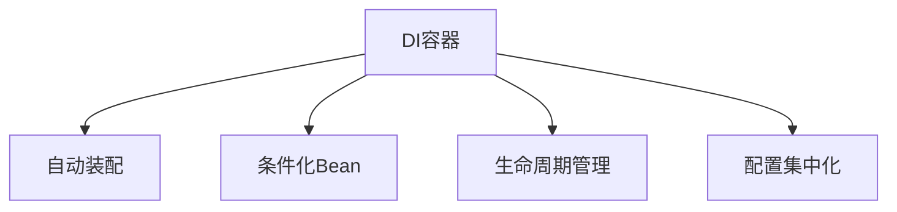

Springboot 中似乎更会使用依赖注入方式，是因为它本身有别的架构来保证前后端分离吗？

---- R1

```ys_think

<icon>https://wy-static.wenxiaobai.com/bot-capability/prod/%E6%B7%B1%E5%BA%A6%E6%80%9D%E8%80%83.png</icon>

<start>思考中...</start>

好的，我需要回答用户关于为什么Spring Boot中更常使用依赖注入的问题，特别是与前后端分离架构的关系。用户之前讨论了Qt中使用信号与槽机制，现在转向Spring Boot，可能是在比较不同框架的设计哲学。

首先，我要理解依赖注入（DI）在Spring Boot中的作用。Spring Boot的核心是控制反转（IoC）和依赖注入，这些设计模式用于管理对象生命周期和依赖关系。在Spring中，DI通过自动装配实现，减少了样板代码，提高了模块化。

接下来，用户提到Spring Boot使用DI是否因为前后端分离架构。我需要解释Spring Boot主要用于后端服务，其DI机制与后端的分层架构（如Controller、Service、Repository）有关，而不是直接处理前后端分离。前后端分离更多涉及REST API和前端框架（如React、Angular），但Spring的DI确实支持这种架构，因为它促进了各层之间的解耦。

然后，我需要比较Spring Boot和Qt的上下文差异。Qt是GUI框架，强调事件驱动和UI组件交互，信号与槽适合处理用户交互。而Spring Boot是企业级后端框架，DI更适合管理复杂的业务逻辑和数据层依赖。两者的设计目标不同，导致不同的设计选择。

我还需要考虑用户可能的误解，即认为前后端分离直接导致使用DI。实际上，DI在后端内部各层之间解耦，而前后端分离是通过API实现的，两者不同但互补。需要澄清这一点，并举例说明DI在Spring中的典型应用场景，如Service注入到Controller。

最后，总结Spring Boot使用DI的主要原因：促进松耦合、增强可测试性、便于模块化管理，以及Spring框架本身的设计支持。同时指出前后端分离是通过RESTful服务实现的，而DI是后端内部结构的一部分，两者共同支持了现代应用架构。

<end>已深度思考（用时12秒）</end>

```

在 Spring Boot 中更推荐依赖注入（DI），这与框架的设计哲学和应用场景密切相关，但**与前后端分离没有直接因果关系**。以下是深度解析：

---

### 一、核心差异：框架定位与设计目标

| **维度**         | Spring Boot                  | Qt/PySide                |
| ---------------- | ---------------------------- | ------------------------ |
| **应用领域**     | 后端服务/企业应用            | 桌面 GUI 应用            |
| **主要通信方式** | HTTP/REST API                | 本地事件循环             |
| **架构核心**     | 分层架构(Controller-Service) | 组件化 UI 架构           |
| **生命周期管理** | 需要管理 Bean 依赖关系       | 自动管理窗口组件生命周期 |

---

### 二、Spring Boot 依赖注入的优势来源

#### 1. 分层架构需求

典型的 Spring Boot 分层结构：

```java
@RestController         // <- 前端入口
public class UserController {
    @Autowired          // DI注入Service层
    private UserService userService;
}

@Service               // <- 业务逻辑层
public class UserService {
    @Autowired         // DI注入DAO层
    private UserRepository userRepo;
}

@Repository            // <- 数据访问层
public interface UserRepository extends JpaRepository<User, Long> {}
```

**DI 的作用**：

- 解耦各层之间的依赖
- 便于单元测试（可 Mock 依赖）
- 实现 AOP 等高级特性

#### 2. 企业级应用特性需求

| **需求**     | DI 实现方案             | 信号机制不适用原因   |
| ------------ | ----------------------- | -------------------- |
| 事务管理     | `@Transactional`注解    | 无事务上下文传递机制 |
| 安全上下文   | `SecurityContextHolder` | 无法跨组件保持状态   |
| 多数据源配置 | `@Primary`/`@Qualifier` | 缺乏资源管理能力     |

#### 3. Spring 生态的强力支持



---

### 三、前后端分离的影响

#### 1. 前后端分离架构特点

```text
Browser ↔ REST API (Spring) ↔ Database
        ↔ React/Vue静态资源
```

**DI 的作用点**：

- 后端内部各层的解耦
- 微服务间通信(通过 FeignClient 等)
- 配置中心集成

#### 2. 与 DI 的间接关系

虽然不直接相关，但前后端分离架构需要：

- 清晰的 API 契约（Swagger 等）
- 稳定的服务接口
  这些需求通过 DI 带来的松耦合架构更容易实现

---

### 四、关键设计对比

| **设计决策** | Spring Boot            | Qt/PySide              |
| ------------ | ---------------------- | ---------------------- |
| 对象创建     | 容器管理单例 Bean      | 手动创建 UI 组件       |
| 依赖解析     | 自动类型匹配           | 显式传递引用           |
| 扩展方式     | 通过 BeanPostProcessor | 信号/槽继承机制        |
| 生命周期事件 | `@PostConstruct`注解   | `show()`/`close()`方法 |

---

### 五、何时选择哪种模式？

#### 1. 优先使用 DI 的场景

- 需要管理复杂依赖树

```java
// 多层依赖示例
@Controller → @Service → @Repository → JdbcTemplate → DataSource
```

- 需要 AOP 切面编程

```java
@Around("@annotation(com.example.Loggable)")
public Object logExecutionTime(ProceedingJoinPoint joinPoint) {...}
```

- 需要条件化配置

```java
@Bean
@ConditionalOnProperty("cache.enabled")
public CacheManager cacheManager() {...}
```

#### 2. 优先使用信号机制的场景

- GUI 事件传播

```python
button.clicked.connect(self._handle_click)
```

- 跨窗口通信

```python
main_window.data_ready.connect(child_window.update_data)
```

- 异步任务通知

```python
worker.finished.connect(self._on_worker_finished)
```

---

### 六、现代架构的融合实践

#### 混合使用示例（Spring Boot + WebSocket）

```java
@Controller
public class ChatController {
    @Autowired // DI注入业务服务
    private ChatService chatService;

    @MessageMapping("/chat")
    @SendTo("/topic/messages")
    public Message send(Message message) {
        // 使用DI的服务处理消息
        return chatService.processMessage(message);
    }
}
```

这里同时使用了：

- DI 管理服务依赖
- 消息协议（类似信号机制）处理实时通信

---

### 结论：选择依据

| **决定因素**         | 推荐方案    |
| -------------------- | ----------- |
| 开发 GUI 桌面应用    | 信号/槽机制 |
| 构建后端服务/微服务  | 依赖注入    |
| 需要复杂生命周期管理 | 依赖注入    |
| 处理用户交互事件流   | 信号/槽机制 |
| 需要严格单元测试     | 依赖注入    |

Spring Boot 选择依赖注入的核心原因是其**面向复杂业务系统**的设计定位，需要：

1. 管理大量互相依赖的组件
2. 实现横切关注点（日志、事务等）
3. 支持动态配置和扩展

这与是否采用前后端分离架构无直接关系，而是由服务端应用的固有复杂性决定的。前后端分离架构更多是**通过 REST API 实现**，而 DI 主要用于**后端内部架构管理**，两者属于不同维度的设计决策。
