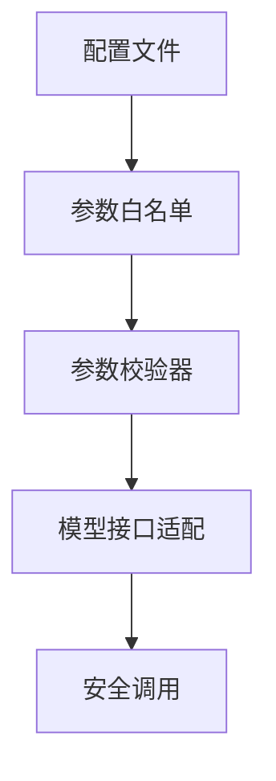

对基于配置的代码来说，存在一个问题，当配置修改时，Model 也得读取对应的参数。但这存在一个问题，Model 本身可能暴露的接口不需要那么多参数，而对不同的应用来说，某些参数可能是需要的，某些参数可能是不需要的，但如果他们面对的是同一个接口，前端只要改改配置不就能修改界面，而且也能调用 model 相关接口嘛？但这和实际需求不符（举例来说就是某个客户购买了 3 个功能，但他调用的接口其实有 5 个功能，只要他们知道哪个字段能用就行，那对 Model 来说验证不是很麻烦吗？

```yaml
watermark_types:
  normal:
    display: "正常"
    handler: "process_normal_watermark"
    npy_path: "watermark_image_450"
    params:
      default_opacity:
        label: "默认透明度" # 增加标签配置
        default: 75 # 参数默认值
        type: "int"
      allowed_formats:
        label: "允许格式"
        default: jpg
        options: [jpg, png]
        type: "dropdown"
  #      size:
  #        min: 1500
  #        max: 2000
  #        default: 50
  #      color:
  #        type: "color"
  #        "options": ["red", "blue"]
  #        "default": "red"
  foggy:
    display: "雾化"
    handler: "process_foggy_watermark"
    npy_path: ""
    params:
      default_font:
        label: "默认字体"
        default: "Arial"
      max_length:
        label: "最大长度"
        default: 100
```

```python
import glob
import os

from config import ConfigLoader
from utils.basic import generate_watermark

class WatermarkModel:
    def __init__(self):
        self.config = ConfigLoader.load_watermark_config()

    def get_watermark_config(self):
        return self.config
    def get_handler(self, wm_type):
        return getattr(self, self.config[wm_type]['handler'])

    def process_normal_watermark(self, folder,  **kwargs):
        # 具体实现
        # print(f"处理正常水印: {folder}, 不透明度: {kwargs['default_opacity']}, 允许格式: {kwargs['allowed_formats']}")
        print({param:data for param, data in kwargs.items()})

    def process_foggy_watermark(self, folder, text="BH", **kwargs):
        # 具体实现
        # print(f"处理雾化水印: {folder}, 文字内容: {text}")
        print({param: data for param, data in kwargs.items()})

    def load_watermark_config(self):
        return self.config

```

---- R1

```ys_think

<icon>https://wy-static.wenxiaobai.com/bot-capability/prod/%E6%B7%B1%E5%BA%A6%E6%80%9D%E8%80%83.png</icon>

<start>思考中...</start>

嗯，用户的问题是关于如何处理配置驱动的界面与模型接口之间的参数匹配问题。根据他们提供的代码和YAML配置，看起来他们希望不同的水印类型对应不同的参数，但模型的方法可能需要不同的参数，这会导致验证困难。比如，用户可能购买了某些功能，但模型接口可能暴露了更多的参数，需要确保只有配置中存在的参数被传递，而其他的被忽略或验证。

首先，我需要理解用户的具体问题。他们在使用配置文件来生成界面，每个水印类型有不同的参数。然而，模型的方法（如process_normal_watermark和process_foggy_watermark）可能需要不同的参数。这时候，如果前端根据配置动态生成参数输入，但模型的方法可能不需要所有参数，或者需要不同的参数，就会导致参数传递错误或验证问题。例如，普通水印可能需要default_opacity和allowed_formats，而雾化水印可能需要default_font和max_length。如果用户在界面上输入了其他参数，模型如何处理这些多余的参数？

接下来，用户提到的问题核心是模型接口的暴露参数与配置中的参数不一致，导致验证麻烦。比如，即使前端通过配置生成了某些参数，但模型的方法可能不需要这些参数，或者需要不同的参数，这时候如何确保只传递有效的参数，并且不传递无效的？

我需要考虑解决方案。可能的解决方案包括参数过滤、接口适配和严格验证。参数过滤是在调用模型方法前，只保留该方法需要的参数。接口适配是使用统一的参数传递方式，比如字典或对象，而不是固定参数列表。严格验证则是在配置中明确每个方法所需的参数，并在调用前检查。

然后，我需要参考用户提供的代码。WatermarkModel中的方法如process_normal_watermark接受**kwargs，这可以接收任意参数，但方法内部可能只使用部分参数。比如process_normal_watermark可能只使用default_opacity和allowed_formats，而其他参数会被忽略。但这样存在安全隐患，比如传递了无效参数，可能被意外使用。或者，如果方法需要特定参数，但配置中没有正确传递，会导致错误。

因此，解决方案需要确保只有配置中定义的参数被传递给模型方法，并且这些参数是方法所需的。可能需要动态地从配置中获取每个处理程序所需的参数列表，并在调用时过滤掉未在配置中定义的参数。此外，可以在配置中为每个处理程序指定所需的参数，这样在传递参数时只传递这些参数，避免多余的参数被传入。

用户还提到不同的客户可能购买不同的功能，但模型接口可能有更多参数。这需要确保即使配置中只有部分参数，模型方法也能正确处理，忽略未购买的参数。或者，在验证阶段检查传递的参数是否在允许的范围内，比如配置中定义的参数。

可能的实现步骤包括：

1. 在配置中为每个处理程序定义所需的参数列表，这样在调用时可以根据该列表过滤参数。
2. 在模型的方法中，显式声明所需的参数，而不是使用**kwargs，以提高安全性和可维护性。
3. 在调用模型方法前，从界面输入中提取配置中定义的参数，并验证它们是否符合要求（如类型、范围等）。
4. 使用装饰器或中间件来统一处理参数过滤和验证，减少重复代码。

例如，在配置中为每个处理程序添加required_params字段，然后在调用方法前检查参数是否满足这些要求。如果参数不在required_params中，则忽略或报错。同时，模型的方法可以明确声明它们需要的参数，而不是使用**kwargs，这样在调用时如果传递了未声明的参数，会抛出错误。

另外，考虑到用户当前的方法使用**kwargs，可能更倾向于灵活的参数传递，但需要确保只有有效的参数被传递。因此，可以在调用方法前，根据配置中定义的参数列表来过滤kwargs，只保留有效的参数。例如，在配置中每个handler有一个params部分，列出所有有效参数，这样在调用时，从kwargs中筛选出这些参数。

此外，可能需要一个参数验证层，在将参数传递给模型方法之前，检查参数的类型、范围等是否符合配置中的定义。例如，如果某个参数被定义为int类型，并且有min和max值，那么在传递前需要确保输入的值在此范围内。

总结来说，用户需要一种机制来确保前端根据配置生成的参数能够正确、安全地传递给模型的方法，并且模型方法只接收它们需要的参数，同时处理多余的或无效的参数。这可以通过配置中的参数定义、参数过滤和验证层来实现。

<end>已深度思考（用时33秒）</end>

```

针对配置驱动开发中的参数验证问题，这里提供一种安全可控的解决方案：

### 解决方案架构



### 1. 配置增强：明确参数约束 (config.yaml)

```yaml
watermark_types:
  normal:
    handler: "process_normal_watermark"
    params:
      default_opacity:
        label: "透明度"
        type: int
        required: true # 新增必填标记
        min: 0
        max: 100
        default: 75
      allowed_formats:
        label: "允许格式"
        type: list[str]
        options: [jpg, png]
        default: jpg
  foggy:
    handler: "process_foggy_watermark"
    params:
      default_font:
        label: "默认字体"
        type: str
        required: false
        default: "Arial"
```

### 2. 模型层改造：安全接口适配

```python
from pydantic import validate_arguments
from functools import wraps

class WatermarkModel:
    def __init__(self):
        self.config = ConfigLoader.load_watermark_config()
        self._build_handlers()

    def _build_handlers(self):
        """动态创建带验证的处理方法"""
        for wm_type in self.config:
            handler_name = self.config[wm_type]['handler']
            original_method = getattr(self, handler_name)

            # 生成参数约束规则
            param_rules = {
                param: {'type': info['type'], **info.get('validations', {})}
                for param, info in self.config[wm_type]['params'].items()
            }

            # 创建带验证的包装方法
            @wraps(original_method)
            def validated_method(folder, *args, **kwargs):
                sanitized = self._sanitize_params(wm_type, kwargs)
                return original_method(folder, *args, **sanitized)

            setattr(self, handler_name, validated_method)

    def _sanitize_params(self, wm_type, raw_params):
        """参数清洗与验证"""
        valid_params = {}
        for param, config in self.config[wm_type]['params'].items():
            # 必填校验
            if config.get('required') and param not in raw_params:
                raise ValueError(f"缺少必要参数: {param}")

            # 类型转换
            value = raw_params.get(param, config['default'])
            try:
                valid_params[param] = self._cast_type(value, config['type'])
            except Exception as e:
                raise ValueError(f"参数 {param} 类型错误: {str(e)}")

            # 范围校验
            if 'options' in config:
                if valid_params[param] not in config['options']:
                    raise ValueError(f"参数 {param} 值不在允许范围内")
            if 'min' in config and valid_params[param] < config['min']:
                raise ValueError(f"参数 {param} 值小于最小值 {config['min']}")
            if 'max' in config and valid_params[param] > config['max']:
                raise ValueError(f"参数 {param} 值大于最大值 {config['max']}")

        return valid_params

    def _cast_type(self, value, target_type):
        """安全类型转换"""
        type_map = {
            'int': int,
            'str': str,
            'float': float,
            'bool': lambda v: str(v).lower() in ['true', '1', 'yes'],
            'list[str]': lambda v: [s.strip() for s in str(v).split(',')]
        }
        return type_map[target_type](value)
```

### 3. 调用层改造：安全参数传递

```python
class Presenter:
    def generate_watermark(self):
        wm_type = self.view.combo.currentData()
        try:
            # 获取原始输入
            raw_params = self.view.get_param_values(wm_type)

            # 调用带验证的方法
            handler = self.model.get_handler(wm_type)
            handler(self.view.get_folder_path(), **raw_params)

        except ValueError as e:
            self.view.show_error(str(e))
```

### 关键机制说明

1. **动态参数白名单**：

   - 每个处理方法的可用参数完全由配置定义
   - 自动过滤未在配置中声明的参数

2. **类型安全转换**：

```python
# 示例输入转换
_input = "75"  # 用户输入的字符串
_output = _cast_type(_input, 'int')  # → 75 (int类型)
```

3. **多级校验机制**：

   - **必填检查**：标记为`required: true`的参数必须存在
   - **类型检查**：强制转换为配置声明的类型
   - **范围检查**：自动校验数字范围和枚举值

4. **错误隔离设计**：

```python
try:
    handler(**params)
except ValueError as e:
    # 统一捕获所有参数错误
    show_error_to_user(e)
```

### 扩展性设计

1. **自定义验证规则**：

```yaml
params:
  output_size:
    type: tuple[int]
    validations:
      format: "(width,height)" # 支持自定义校验函数
```

2. **动态界面生成**：

```python
# 根据配置生成校验提示
for param in params:
    if 'min' in param:
        input_widget.setToolTip(f"最小值: {param['min']}")
```

3. **权限控制扩展**：

```yaml
watermark_types:
  premium_feature:
    requires_license: true # 可扩展授权控制
    params: [...]
```

这种架构实现了配置与模型的解耦，在保证安全性的同时保持灵活性。前端只需根据配置渲染界面，后端自动适配参数要求，各层职责分明且易于维护。
