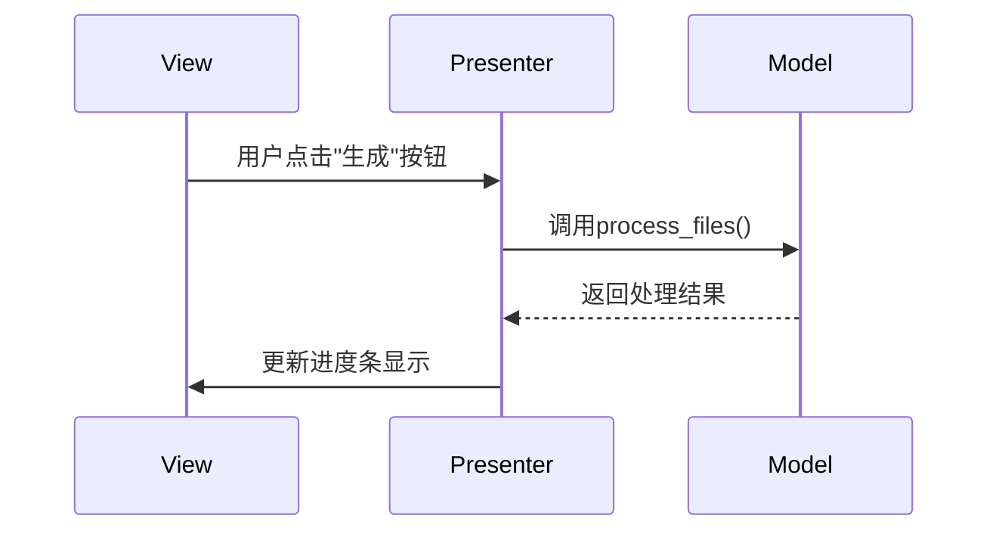

这里的 presenter 是什么？

----- R1

```ys_think

<icon>https://wy-static.wenxiaobai.com/bot-capability/prod/%E6%B7%B1%E5%BA%A6%E6%80%9D%E8%80%83.png</icon>

<start>思考中...</start>

好的，用户现在问的是“这里的presenter是什么？”，我需要先回顾之前的对话，确保理解上下文。用户之前询问如何将UI和业务逻辑分离，我给出了一个使用MVP模式的例子，其中提到了Presenter层。现在用户对Presenter的概念不太清楚，需要详细解释。

首先，我需要确定用户的背景。可能他们不太熟悉设计模式，尤其是MVP模式。Presenter在MVP中扮演的角色可能与其他模式如MVC中的Controller有相似之处，但也有不同。我需要用简单明了的语言解释Presenter的作用，并结合之前的代码示例来说明。

用户可能混淆了Presenter和Controller，或者对分层架构不太了解。我应该比较MVP和MVC的区别，帮助用户理解为什么在这里使用Presenter而不是Controller。同时，用户可能想知道Presenter的具体职责，比如如何处理View和Model之间的交互。

在之前的代码中，MainPresenter类负责连接View和Model，处理信号和业务逻辑。我需要详细说明这个类中的方法，比如如何响应View的事件，调用Model的方法，以及处理错误校验等。用户可能需要具体的例子来理解Presenter的工作流程。

此外，用户可能想知道为什么需要引入Presenter层，有什么好处。这时候需要强调分离关注点、提高可测试性和维护性的优点。同时，可能需要指出Presenter在MVP中的桥梁作用，协调View和Model，避免它们直接耦合。

还要注意用户的问题可能涉及对代码结构的疑问，比如Presenter如何与View和Model交互，信号和槽机制在其中的作用。结合PySide6的信号机制，解释Presenter如何监听View的事件并作出响应，再调用Model处理数据。

最后，总结Presenter的定义、职责以及使用它的好处，确保用户能够全面理解Presenter在架构中的重要性。可能需要避免使用过于专业的术语，用更通俗的例子或比喻来帮助用户建立直观的理解。

<end>已深度思考（用时13秒）</end>

```

在软件架构模式中，**Presenter** 是 **MVP（Model-View-Presenter）模式** 的核心组件，它充当 **界面（View）** 和 **业务逻辑/数据（Model）** 之间的桥梁。以下是对 Presenter 的详细解释：

---

### 一、Presenter 的定位

#### 1. **与 MVC 的区别**：

- 在 **MVC（Model-View-Controller）** 中：
  - **Controller** 直接处理用户输入并更新 Model 和 View
- 在 **MVP** 中：
  - **Presenter** 取代了 Controller，但它不直接操作界面元素
  - View 和 Model 完全解耦，通过 Presenter 间接通信

#### 2. **核心职责**：

- **从 View 接收用户操作事件**
- **调用 Model 处理业务逻辑**
- **将处理结果反馈给 View 更新界面**
- **管理 View 和 Model 的生命周期**

---

### 二、在你的代码中 Presenter 的作用

以重构后的代码为例：

#### 1. **监听 View 的事件**

```python
# Presenter 中连接 View 的信号
self.view.generate_triggered.connect(self.handle_generate)
```

- 当用户点击 "生成水印" 按钮时，View 会发射 `generate_triggered` 信号
- Presenter 监听到信号后，触发 `handle_generate` 方法

#### 2. **处理业务逻辑**

```python
def handle_generate(self, index, watermark_type):
    # 校验输入
    opacity = self.view.opacity_input.text() or 50
    if not 0 <= opacity <= 100:
        self.view.show_error("不透明度需在0-100之间")
        return

    # 调用 Model 处理数据
    for filename in self.model.process_files(...):
        self.view.update_progress(filename)
```

- 校验用户输入的合法性
- 调用 Model 的 `process_files` 方法生成水印

#### 3. **更新 View 状态**

```python
# 在 Presenter 中控制界面反馈
self.view.update_topmost_status(is_topmost)
```

- 根据业务逻辑结果更新界面元素（如进度条、错误提示）

#### 4. **协调模块交互**



---

### 三、Presenter 的关键特征

#### 1. **被动响应式**

- 不主动操作界面，而是通过监听 View 的信号触发操作

#### 2. **无界面依赖**

- 不包含任何界面组件的具体实现（如 `QPushButton` 等）

#### 3. **可测试性**

```python
# 可以单独测试 Presenter 的逻辑
def test_generate_with_invalid_opacity():
    view = MockView()
    presenter = MainPresenter(view, model)
    presenter.handle_generate(0, "type1")
    assert "不透明度需在0-100之间" in view.error_message
```

#### 4. **业务逻辑聚合**

- 集中处理所有与界面操作相关的业务规则

---

### 四、Presenter 与类似组件的对比

|                | Presenter (MVP)    | Controller (MVC)   | ViewModel (MVVM)     |
| -------------- | ------------------ | ------------------ | -------------------- |
| **界面操作权** | 不直接操作界面元素 | 直接操作界面元素   | 通过数据绑定驱动界面 |
| **数据绑定**   | 手动同步           | 手动同步           | 自动双向绑定         |
| **适用场景**   | 复杂桌面应用       | Web 应用           | 数据驱动型应用       |
| **典型框架**   | PyQt、WinForms     | Django、Spring MVC | WPF、Vue.js          |

---

### 五、为什么需要 Presenter？

#### 1. **解耦界面与逻辑**

- 修改界面样式（如将按钮从绿色改为蓝色）不需要改动业务逻辑代码

#### 2. **提升可维护性**

```python
# 修改水印生成逻辑时，只需修改 Presenter 和 Model
def handle_generate(self):
    # 新增文件类型过滤逻辑
    if not self._validate_file_types():
        return
    # 原有逻辑...
```

#### 3. **支持多平台适配**

- 同一套 Presenter 和 Model 可以搭配不同的 View 实现（如桌面端和 Web 端）

#### 4. **便于团队协作**

- 界面设计师和业务逻辑开发者可以并行工作

---

### 六、Presenter 的最佳实践

#### 1. **瘦 Presenter 原则**

- 复杂的业务逻辑应封装在 Model 中
- Presenter 只负责协调调用

#### 2. **使用依赖注入**

```python
class MainPresenter:
    def __init__(self, view: IView, model: IModel):
        self.view = view
        self.model = model
```

#### 3. **定义清晰接口**

```python
class IView(Protocol):
    def update_progress(self, value: int): ...
    def show_error(self, message: str): ...
```

#### 4. **异步处理**

```python
async def handle_generate(self):
    await self.model.async_process_files()
    self.view.update_status("完成")
```

---

通过使用 Presenter，你的代码会变得更加模块化、可测试和可维护。这种模式特别适合需要长期迭代的桌面应用程序开发。
