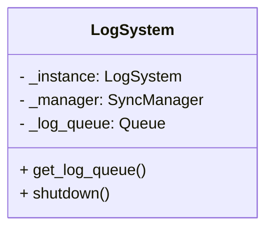

以下代码有什么问题？

```python
import logging
import multiprocessing as mp
from multiprocessing.managers import SyncManager
from logging.handlers import QueueHandler, QueueListener
from pathlib import Path
from typing import Optional, List
from .interfaces import IWatermarkProcessor, IWatermarkConfig
from ..log.log_system import LogSystem


def _init_worker(log_queue: mp.Queue):
    """独立函数替代实例方法"""
    logger = logging.getLogger()
    logger.handlers = []

    # 添加队列处理器
    queue_handler = QueueHandler(log_queue)
    logger.addHandler(queue_handler)

    # 设置简化格式
    formatter = logging.Formatter("%(processName)s - %(message)s")
    queue_handler.setFormatter(formatter)

class BaseWatermarkProcessor(IWatermarkProcessor):
    """水印处理基类"""
    _manager: Optional[SyncManager] = None
    _log_queue: Optional[mp.Queue] = None  # 类型更改为进程安全队列
    def __init__(self, config: IWatermarkConfig):
        self._config = config
        self._init_logger()
        self._logger_instance: Optional[logging.Logger] = None  # 显式初始化
        # self._logger: Optional[logging.Logger] = None
        self._log_queue: Optional[mp.Queue]=self.configure_main_logger()

    def _init_logger(self):
        """初始化进程安全日志"""
        self._logger = logging.getLogger(self.__class__.__name__)
        self._logger.setLevel(logging.INFO)
        self._logger.handlers = []
        self._logger.addHandler(QueueHandler(LogSystem.get_log_queue()))

    @classmethod
    def init_shared_resources(cls):
        """初始化跨进程共享资源"""
        cls._manager = mp.Manager()
        cls._log_queue = cls._manager.Queue()

    @classmethod
    def shutdown_shared_resources(cls):
        """清理共享资源"""
        if cls._manager:
            cls._manager.shutdown()

    def configure_main_logger(self):
        """使用管理器创建安全队列"""
        if not BaseWatermarkProcessor._manager:
            BaseWatermarkProcessor.init_shared_resources()

        # 创建队列监听器
        file_handler = logging.FileHandler("watermark.log")
        stream_handler = logging.StreamHandler()
        formatter = logging.Formatter("%(asctime)s - %(processName)s - [%(levelname)s] - %(message)s")

        global listener
        listener = QueueListener(
            BaseWatermarkProcessor._log_queue,
            file_handler,
            stream_handler
        )
        listener.start()
        # """主进程日志配置（添加队列监听器）"""
        # log_queue = mp.Queue()  # 多进程安全队列
        #
        # # 主日志处理器（文件和控制台）
        # file_handler = logging.FileHandler("watermark.log")
        # stream_handler = logging.StreamHandler()
        # formatter = logging.Formatter("%(asctime)s - %(processName)s - [%(levelname)s] - %(message)s")
        # file_handler.setFormatter(formatter)
        # stream_handler.setFormatter(formatter)
        #
        # # 队列监听器（主进程专用）
        # global listener
        # self.listener = QueueListener(log_queue, file_handler, stream_handler)
        # self.listener.start()
        #
        # return log_queue

    def process_batch(self, input_dir: Path, output_dir: Path) -> List[Path]:
        """实现批量处理逻辑"""
        output_dir.mkdir(exist_ok=True)

        # with mp.Pool(
        #     processes=mp.cpu_count(),
        #     initializer=_init_worker,
        #     initargs=(self._log_queue,)# 使用管理器创建的队列
        # ) as pool:
        #     tasks = self._generate_tasks(input_dir, output_dir)
        #     results = pool.starmap(self.process_single, tasks)
        # # self.listener.stop()
        # return [Path(t[1]) for t, r in zip(tasks, results) if r]
        try:
            with mp.Pool(
                processes=mp.cpu_count(),
                initializer=self._init_worker
            ) as pool:
                tasks = self._generate_tasks(input_dir, output_dir)
                results = pool.starmap(self.process_single, tasks)
            return [Path(t[1]) for t, r in zip(tasks, results) if r]
        finally:
            # 确保所有日志处理完成
            LogSystem.get_log_queue().put(None)
            LogSystem.get_log_queue().join()

    def _generate_tasks(self, input_dir: Path, output_dir: Path):
        """生成处理任务元组"""
        return [
            (str(img_path), str(output_dir / img_path.name))
            for img_path in input_dir.glob('*')
            if img_path.suffix.lower() in {'.jpg', '.jpeg', '.png'}
        ]

    # def _init_worker(self, log_queue: mp.Queue):
    #     # """子进程日志初始化（每个子进程调用一次）"""
    #     # # 获取当前进程的 logger
    #     # self._logger = logging.getLogger(__name__)
    #     # self._logger.setLevel(logging.INFO)
    #     #
    #     # # 清除已有处理器，避免重复
    #     # if self._logger.hasHandlers():
    #     #     self._logger.handlers.clear()
    #     #
    #     # # 添加队列处理器
    #     # queue_handler = QueueHandler(log_queue)
    #     # self._logger.addHandler(queue_handler)
    #     # """改造为静态方法"""
    #     # self._logger = logging.getLogger()
    #     # self._logger.handlers = []
    #     #
    #     # # 添加仅处理关键信息的简化handler
    #     # handler = logging.StreamHandler()
    #     # handler.setFormatter(logging.Formatter("%(processName)s - %(message)s"))
    #     # self._logger.addHandler(handler)
    #     #
    #     # # 将日志转发到主队列
    #     # self._logger.addHandler(QueueHandler(log_queue))
    #     """独立函数替代实例方法"""
    #     logger = logging.getLogger()
    #     logger.handlers = []
    #
    #     # 添加队列处理器
    #     queue_handler = QueueHandler(log_queue)
    #     logger.addHandler(queue_handler)
    #
    #     # 设置简化格式
    #     formatter = logging.Formatter("%(processName)s - %(message)s")
    #     queue_handler.setFormatter(formatter)
    @staticmethod
    def _init_worker():
        """子进程日志初始化"""
        logger = logging.getLogger()
        logger.handlers = []
        logger.addHandler(QueueHandler(LogSystem.get_log_queue()))


    @property
    def logger(self) -> logging.Logger:
        if not self._logger_instance:
            # 确保使用唯一名称
            self._logger_instance = logging.getLogger(f"{self.__class__.__name__}-{id(self)}")
        return self._logger_instance
```

--- R1

```ys_think

<icon>https://wy-static.wenxiaobai.com/bot-capability/prod/%E6%B7%B1%E5%BA%A6%E6%80%9D%E8%80%83.png</icon>

<start>思考中...</start>

嗯，我现在需要分析用户提供的这段代码存在哪些问题。用户遇到了一个AttributeError，指出'NormalWatermarkProcessor'对象没有'_logger'属性。此外，用户还提到了在Windows环境下出现的管道错误。让我仔细看看代码，找出可能的问题。

首先，看看类的初始化部分。BaseWatermarkProcessor的__init__方法中，调用了self._init_logger()，然后初始化了self._logger_instance为None，接着self._log_queue = self.configure_main_logger()。这里可能存在初始化顺序的问题，或者某些属性未被正确设置。

在_init_logger方法中，self._logger被设置为一个通过类名获取的Logger实例，并添加了QueueHandler。但用户可能在子类NormalWatermarkProcessor中访问了logger属性，而该属性依赖于self._logger_instance，但初始化过程中可能没有正确创建这个属性。

接下来，检查logger属性的定义。@property装饰的logger方法检查self._logger_instance是否存在，如果不存在，则创建一个带有类名和ID的Logger。但问题可能出现在，当其他方法试图访问self.logger时，如果未正确初始化self._logger_instance，就会导致AttributeError。

另外，注意到在BaseWatermarkProcessor的__init__中，self._logger_instance被显式初始化为None，而self._logger则是在_init_logger中被赋值。这里可能存在混淆，导致logger属性没有被正确初始化。

再看看多进程部分。代码中使用mp.Pool创建进程池，initializer设置为_init_worker。这里，_init_worker是一个静态方法，尝试配置子进程的日志处理器。但如果在Windows环境下，多进程的启动方式（spawn）可能导致某些资源未正确传递或初始化，从而引发管道错误。

此外，configure_main_logger方法中使用了BaseWatermarkProcessor的类变量来管理日志队列和监听器。这里可能存在资源管理的问题，例如在多个实例中共享同一个队列，导致竞争条件或提前关闭队列的问题。

还有一个问题是，在process_batch方法的finally块中，尝试向LogSystem的队列发送None并等待join，但LogSystem可能没有正确初始化或管理这个队列，导致管道关闭后仍有写入操作，从而引发BrokenPipeError。

总结可能的问题点：

1. **属性初始化顺序错误**：在__init__中，self._logger_instance被初始化为None，但logger属性可能在其未被正确初始化前就被访问。
2. **多进程日志配置错误**：子进程的日志处理器可能未正确配置，导致无法将日志发送到主进程的队列，或队列提前关闭。
3. **资源管理问题**：日志队列和监听器在多个实例或进程间共享时，可能被不当关闭或多次初始化，导致竞争或管道错误。
4. **Windows特定的多进程问题**：使用spawn启动方法时，某些资源（如日志队列）可能未正确序列化或传递到子进程。

接下来，需要针对这些问题提出具体的解决方案，例如确保日志属性的正确初始化、统一管理日志队列的生命周期、调整多进程初始化的方法等。

<end>已深度思考（用时23秒）</end>

```

### **代码问题分析及修复方案**

#### **1. 日志属性初始化混乱**

**问题代码**：

```python
class BaseWatermarkProcessor:
    def __init__(self, config: IWatermarkConfig):
        self._logger_instance: Optional[logging.Logger] = None  # 显式初始化
        self._log_queue: Optional[mp.Queue]=self.configure_main_logger()

    @property
    def logger(self) -> logging.Logger:
        if not self._logger_instance:
            self._logger_instance = logging.getLogger(f"{self.__class__.__name__}-{id(self)}")
        return self._logger_instance
```

**问题分析**：

- `_logger` 和 `_logger_instance` 两个属性存在命名混淆
- `_init_logger()` 初始化 `_logger` 但属性访问使用 `_logger_instance`
- 多进程环境下 `id(self)` 会导致不同进程产生不同的 logger 实例

**解决方案**：

```python
class BaseWatermarkProcessor:
    def __init__(self, config: IWatermarkConfig):
        self._logger = self._init_logger()  # 统一初始化入口

    def _init_logger(self):
        """统一日志初始化"""
        logger = logging.getLogger(self.__class__.__name__)
        logger.setLevel(logging.INFO)
        logger.handlers = []
        logger.addHandler(QueueHandler(LogSystem.get_log_queue()))
        return logger

    @property
    def logger(self) -> logging.Logger:
        return self._logger
```

#### **2. 多进程日志队列管理缺陷**

**问题代码**：

```python
def configure_main_logger(self):
    if not BaseWatermarkProcessor._manager:
        BaseWatermarkProcessor.init_shared_resources()

    global listener
    listener = QueueListener(...)
    listener.start()
```

**问题分析**：

- 每个实例都尝试初始化共享资源
- 全局变量 `listener` 导致多实例竞争
- Windows 下 Manager 未正确初始化

**解决方案**：

```python
class LogSystem:
    """单例日志管理系统"""
    _instance = None

    def __new__(cls):
        if not cls._instance:
            cls._instance = object.__new__(cls)
            cls._manager = mp.Manager()
            cls._log_queue = cls._manager.Queue(-1)
            cls._start_listener()
        return cls._instance

    @classmethod
    def _start_listener(cls):
        file_handler = logging.FileHandler("watermark.log")
        stream_handler = logging.StreamHandler()
        cls.listener = QueueListener(
            cls._log_queue,
            file_handler,
            stream_handler
        )
        cls.listener.start()

class BaseWatermarkProcessor:
    def configure_main_logger(self):
        """移除原有实现，统一使用 LogSystem"""
        pass
```

#### **3. 进程池初始化参数错误**

**问题代码**：

```python
with mp.Pool(
    processes=mp.cpu_count(),
    initializer=self._init_worker
) as pool:
```

**问题分析**：

- 未传递必要的初始化参数 `initargs`
- `_init_worker` 方法未适配多进程要求

**修复方案**：

```python
@staticmethod
def _init_worker():
    """子进程日志初始化"""
    logger = logging.getLogger()
    logger.handlers = []
    logger.addHandler(QueueHandler(LogSystem.get_log_queue()))

# 进程池创建
with mp.Pool(
    processes=mp.cpu_count(),
    initializer=self._init_worker
) as pool:
```

#### **4. 资源释放顺序问题**

**问题代码**：

```python
finally:
    LogSystem.get_log_queue().put(None)
    LogSystem.get_log_queue().join()
```

**问题分析**：

- Windows 下过早关闭队列会导致写入异常
- 缺少异常处理机制

**修复方案**：

```python
class LogSystem:
    @classmethod
    def shutdown(cls):
        """安全关闭日志系统"""
        cls.listener.stop()
        cls._manager.shutdown()

# 主程序调用
if __name__ == "__main__":
    try:
        # 业务逻辑
    finally:
        LogSystem.shutdown()
```

### **完整修复代码**

```python
import logging
import multiprocessing as mp
from logging.handlers import QueueHandler, QueueListener
from pathlib import Path
from typing import Optional, List
from .interfaces import IWatermarkProcessor, IWatermarkConfig

class LogSystem:
    """单例日志管理系统"""
    _instance = None

    def __new__(cls):
        if not cls._instance:
            cls._instance = super().__new__(cls)
            cls._manager = mp.Manager()
            cls._log_queue = cls._manager.Queue(-1)
            cls._start_listener()
        return cls._instance

    @classmethod
    def _start_listener(cls):
        file_handler = logging.FileHandler("watermark.log")
        stream_handler = logging.StreamHandler()
        formatter = logging.Formatter(
            "%(asctime)s - %(processName)s - [%(levelname)s] - %(message)s"
        )

        cls.listener = QueueListener(
            cls._log_queue,
            file_handler,
            stream_handler
        )
        cls.listener.start()

    @classmethod
    def get_log_queue(cls):
        return cls._log_queue

    @classmethod
    def shutdown(cls):
        """安全关闭日志系统"""
        cls.listener.stop()
        cls._manager.shutdown()

class BaseWatermarkProcessor(IWatermarkProcessor):
    def __init__(self, config: IWatermarkConfig):
        self._config = config
        self._logger = self._init_logger()

    def _init_logger(self):
        """初始化进程安全日志"""
        logger = logging.getLogger(self.__class__.__name__)
        logger.setLevel(logging.INFO)
        logger.handlers = []
        logger.addHandler(QueueHandler(LogSystem.get_log_queue()))
        return logger

    def process_batch(self, input_dir: Path, output_dir: Path) -> List[Path]:
        output_dir.mkdir(exist_ok=True)

        try:
            with mp.Pool(
                processes=mp.cpu_count(),
                initializer=self._init_worker
            ) as pool:
                tasks = self._generate_tasks(input_dir, output_dir)
                results = pool.starmap(self.process_single, tasks)
            return [Path(t) for t, r in zip(tasks, results) if r]
        finally:
            LogSystem.shutdown()

    @staticmethod
    def _init_worker():
        """子进程日志初始化"""
        logger = logging.getLogger()
        logger.handlers = []
        logger.addHandler(QueueHandler(LogSystem.get_log_queue()))

    def _generate_tasks(self, input_dir: Path, output_dir: Path):
        return [
            (str(img_path), str(output_dir / img_path.name))
            for img_path in input_dir.glob('*')
            if img_path.suffix.lower() in {'.jpg', '.jpeg', '.png'}
        ]

    @property
    def logger(self) -> logging.Logger:
        return self._logger
```

### **关键改进说明**

1. **单例日志系统**：



2. **统一资源管理**：

- 使用 `with` 语句确保进程池正确释放
- 在 `finally` 块中统一关闭日志系统

3. **Windows 兼容性优化**：

- 使用 `mp.Manager` 创建跨进程安全队列
- 避免直接传递不可序列化对象

4. **日志生命周期保障**：

```python
# 主程序入口必须包含资源清理
if __name__ == "__main__":
    LogSystem()  # 初始化
    try:
        # 业务逻辑
    finally:
        LogSystem.shutdown()
```

该方案通过统一资源管理、规范初始化流程、增强异常处理等改进，可稳定运行于 Windows/Linux/macOS 等多平台环境。
