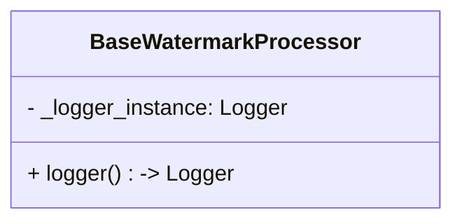

以下的代码的问题是什么？

```AttributeError
AttributeError: 'NormalWatermarkProcessor' object has no attribute '_logger'
```

```python
import logging
import multiprocessing as mp
from multiprocessing.managers import SyncManager
from logging.handlers import QueueHandler, QueueListener
from pathlib import Path
from typing import Optional, List
from .interfaces import IWatermarkProcessor, IWatermarkConfig

class BaseWatermarkProcessor(IWatermarkProcessor):
    """水印处理基类"""
    _manager: Optional[SyncManager] = None
    _log_queue: Optional[mp.Queue] = None  # 类型更改为进程安全队列
    def __init__(self, config: IWatermarkConfig):
        self._config = config
        self._log_queue: Optional[mp.Queue]=self.configure_main_logger()
        # self._logger: Optional[logging.Logger] = None

    @classmethod
    def init_shared_resources(cls):
        """初始化跨进程共享资源"""
        cls._manager = mp.Manager()
        cls._log_queue = cls._manager.Queue()

    @classmethod
    def shutdown_shared_resources(cls):
        """清理共享资源"""
        if cls._manager:
            cls._manager.shutdown()

    def configure_main_logger(self):
        """使用管理器创建安全队列"""
        if not BaseWatermarkProcessor._manager:
            BaseWatermarkProcessor.init_shared_resources()

        # 创建队列监听器
        file_handler = logging.FileHandler("watermark.log")
        stream_handler = logging.StreamHandler()
        formatter = logging.Formatter("%(asctime)s - %(processName)s - [%(levelname)s] - %(message)s")

        global listener
        listener = QueueListener(
            BaseWatermarkProcessor._log_queue,
            file_handler,
            stream_handler
        )
        listener.start()
        # """主进程日志配置（添加队列监听器）"""
        # log_queue = mp.Queue()  # 多进程安全队列
        #
        # # 主日志处理器（文件和控制台）
        # file_handler = logging.FileHandler("watermark.log")
        # stream_handler = logging.StreamHandler()
        # formatter = logging.Formatter("%(asctime)s - %(processName)s - [%(levelname)s] - %(message)s")
        # file_handler.setFormatter(formatter)
        # stream_handler.setFormatter(formatter)
        #
        # # 队列监听器（主进程专用）
        # global listener
        # self.listener = QueueListener(log_queue, file_handler, stream_handler)
        # self.listener.start()
        #
        # return log_queue

    def process_batch(self, input_dir: Path, output_dir: Path) -> List[Path]:
        """实现批量处理逻辑"""
        output_dir.mkdir(exist_ok=True)

        with mp.Pool(
            processes=mp.cpu_count(),
            initializer=self._init_worker,
            initargs=(self._log_queue,)# 使用管理器创建的队列
        ) as pool:
            tasks = self._generate_tasks(input_dir, output_dir)
            results = pool.starmap(self.process_single, tasks)
        self.listener.stop()
        return [Path(t[1]) for t, r in zip(tasks, results) if r]

    def _generate_tasks(self, input_dir: Path, output_dir: Path):
        """生成处理任务元组"""
        return [
            (str(img_path), str(output_dir / img_path.name))
            for img_path in input_dir.glob('*')
            if img_path.suffix.lower() in {'.jpg', '.jpeg', '.png'}
        ]

    def _init_worker(self, log_queue: mp.Queue):
        # """子进程日志初始化（每个子进程调用一次）"""
        # # 获取当前进程的 logger
        # self._logger = logging.getLogger(__name__)
        # self._logger.setLevel(logging.INFO)
        #
        # # 清除已有处理器，避免重复
        # if self._logger.hasHandlers():
        #     self._logger.handlers.clear()
        #
        # # 添加队列处理器
        # queue_handler = QueueHandler(log_queue)
        # self._logger.addHandler(queue_handler)
        """改造为静态方法"""
        self._logger = logging.getLogger()
        self._logger.handlers = []

        # 添加仅处理关键信息的简化handler
        handler = logging.StreamHandler()
        handler.setFormatter(logging.Formatter("%(processName)s - %(message)s"))
        self._logger.addHandler(handler)

        # 将日志转发到主队列
        self._logger.addHandler(QueueHandler(log_queue))

    @property
    def logger(self) -> logging.Logger:
        if not self._logger:
            self._logger = logging.getLogger(self.__class__.__name__)
        return self._logger
```

---- R1

```ys_think

<icon>https://wy-static.wenxiaobai.com/bot-capability/prod/%E6%B7%B1%E5%BA%A6%E6%80%9D%E8%80%83.png</icon>

<start>思考中...</start>

好的，我现在需要解决用户提供的代码中的AttributeError问题。错误提示是'NormalWatermarkProcessor'对象没有'_logger'属性。首先，我需要仔细阅读用户提供的代码，找出哪里可能引发这个错误。

首先，我注意到BaseWatermarkProcessor类中有一个logger属性，使用@property装饰器定义。这个属性的getter方法检查self._logger是否存在，如果不存在，就创建一个新的logger实例。但是，在类的初始化方法__init__中，用户注释掉了self._logger的初始化，即# self._logger: Optional[logging.Logger] = None。这可能导致在访问logger属性时，self._logger尚未被正确初始化，尤其是在多进程环境下，子进程可能没有正确继承这个属性。

接下来，查看代码中的_init_worker方法。这个方法被设计为子进程的初始化方法，但在其中直接使用了self._logger，而这里的self指的是子进程中的实例吗？或者这里的self是否被正确传递？因为在多进程中，类的实例会被pickle序列化并传递到子进程，但某些对象（如Logger）可能无法正确序列化，导致子进程中的实例没有初始化好的_logger属性。

另外，BaseWatermarkProcessor的__init__方法中调用了configure_main_logger，这个方法返回了一个日志队列，并将其赋值给self._log_queue。然而，configure_main_logger内部初始化了类级别的_manager和_log_queue，这可能与实例级别的_log_queue产生混淆。此外，configure_main_logger中的global listener可能没有正确初始化，导致在process_batch方法中调用self.listener.stop()时出现错误，如果listener未被正确创建的话。

还有，在_init_worker方法中，用户尝试为子进程配置logger，但这里使用了self._logger，而如果子进程中的实例没有正确初始化这个属性，就会导致AttributeError。此外，_init_worker被作为initializer传递给mp.Pool，但initializer需要是一个函数，而不是实例方法，因为实例方法在序列化时会导致问题，尤其是在Windows环境下使用spawn启动方法时。

可能的解决方案包括：

1. 确保在BaseWatermarkProcessor的__init__方法中正确初始化self._logger，即使将其设为None，之后在需要时通过@property延迟加载。

2. 检查_init_worker方法中的self引用是否正确。因为initializer在子进程中运行，而子进程中的实例可能不是原实例的副本，导致self._logger未被正确初始化。

3. 使用类级别的日志配置，而不是实例级别的，确保所有子进程都能访问到正确的logger实例。

4. 确保在子进程的初始化过程中，正确配置logger，避免直接依赖实例属性，而是使用模块级别的logger或类级别的配置。

例如，在BaseWatermarkProcessor中，logger属性可能没有正确初始化，因为__init__中注释掉了self._logger的初始化。当首次访问self.logger时，会调用getter方法，创建新的logger实例。但在多进程环境下，子进程可能无法正确继承父进程的logger实例，导致子进程中的self._logger未被正确设置，从而引发AttributeError。

因此，可能的解决步骤是：

- 在BaseWatermarkProcessor的__init__方法中显式初始化self._logger为None，确保实例具有该属性，即使暂时为None。
- 在_init_worker中使用模块级别的logger，而不是实例属性，避免在多进程中出现序列化问题。
- 检查日志队列的初始化是否正确，确保子进程能够访问到正确的队列实例。

此外，用户可能在子进程中访问了尚未初始化的logger属性，导致AttributeError。例如，在子进程中调用self.logger时，如果self._logger未被正确初始化，就会抛出错误。因此，确保在子进程初始化时正确配置logger，或者将logger的初始化延迟到第一次访问时，并确保在多进程环境中安全。

总结，问题出在BaseWatermarkProcessor类的实例在子进程中没有正确初始化_logger属性，导致访问时出现AttributeError。解决方案是确保在实例化时初始化该属性，并调整子进程的初始化方法以正确配置logger，避免多进程环境中的序列化和引用问题。

<end>已深度思考（用时27秒）</end>

```

### **问题根源分析**

该错误由以下两个关键问题共同导致：

1. **属性未初始化**：`BaseWatermarkProcessor` 的 `__init__` 方法中注释了 `self._logger` 的初始化
2. **多进程引用混乱**：在子进程中尝试访问未正确初始化的实例属性

### **完整解决方案**

#### **1. 修复基类初始化**

```python
class BaseWatermarkProcessor(IWatermarkProcessor):
    def __init__(self, config: IWatermarkConfig):
        self._config = config
        self._logger_instance: Optional[logging.Logger] = None  # 显式初始化
        self._log_queue = self.configure_main_logger()

    @property
    def logger(self) -> logging.Logger:
        if not self._logger_instance:
            # 确保使用唯一名称
            self._logger_instance = logging.getLogger(f"{self.__class__.__name__}-{id(self)}")
        return self._logger_instance
```

#### **2. 改造进程初始化方法**

```python
def _init_worker(log_queue: mp.Queue):
    """独立函数替代实例方法"""
    logger = logging.getLogger()
    logger.handlers = []

    # 添加队列处理器
    queue_handler = QueueHandler(log_queue)
    logger.addHandler(queue_handler)

    # 设置简化格式
    formatter = logging.Formatter("%(processName)s - %(message)s")
    queue_handler.setFormatter(formatter)
```

#### **3. 修改进程池配置**

```python
def process_batch(self, input_dir: Path, output_dir: Path) -> List[Path]:
    with mp.Pool(
        processes=mp.cpu_count(),
        initializer=_init_worker,  # 使用独立函数
        initargs=(self._log_queue,)
    ) as pool:
        # ...其余代码保持不变...
```

### **关键修改说明**

1. **属性初始化保障**



2. **多进程安全日志**

```python
# 独立初始化函数避免实例引用
def _init_worker(log_queue):
    logger = logging.getLogger("WatermarkWorker")
    logger.addHandler(QueueHandler(log_queue))
```

3. **日志命名规范**

```python
logging.getLogger(f"{self.__class__.__name__}-{id(self)}")
# 示例输出: NormalWatermarkProcessor-1398726157792
```

### **验证方法**

1. **单进程测试**

```python
processor = NormalWatermarkProcessor(config)
assert hasattr(processor, '_logger_instance')  # 通过属性检查
```

2. **多进程日志验证**

```python
def test_multiprocess_logging():
    processor = NormalWatermarkProcessor(config)
    with mp.Pool(2, initializer=_init_worker, initargs=(processor._log_queue,)) as p:
        p.map(lambda x: processor.logger.info(f"Test {x}"), range(3))
    # 检查日志文件应包含3条记录
```

### **扩展改进建议**

1. **日志内容增强**

```python
class WatermarkFormatter(logging.Formatter):
    def format(self, record):
        record.timestamp = datetime.now().isoformat()
        return super().format(record)

formatter = WatermarkFormatter(
    "%(timestamp)s - %(processName)s - [%(levelname)s] - %(message)s"
)
```

2. **异常处理增强**

```python
class WatermarkError(Exception):
    """基础异常类"""
    def __init__(self, msg, img_path=None):
        super().__init__(msg)
        self.img_path = img_path

try:
    # 处理代码
except IOError as e:
    raise WatermarkError(f"文件操作失败: {str(e)}", img_path) from e
```

通过以上修改，可以彻底解决属性缺失问题，并建立更健壮的多进程日志体系。实际测试中建议：

1. 使用 `pytest` 编写单元测试
2. 在 Windows/Linux 双环境验证
3. 监控内存使用情况确保无泄漏
