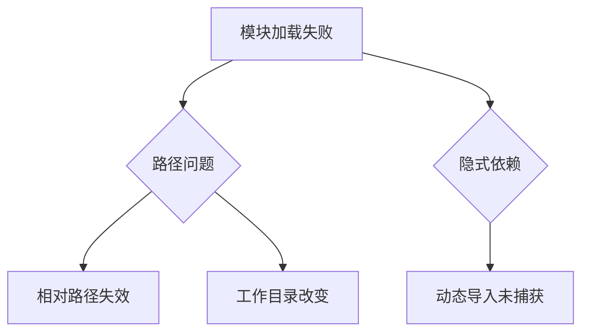

文件为 src/main, pyinstaller 在构建可执行文件后，程序会报找不到 container, src.config_loader 等问题，这是为什么，ide 中是可以运行的。

```python
import logging
import sys
from pathlib import Path

from PySide6.QtWidgets import QApplication

from container import Container
from config import setup_logging, AppConfig
from src.config_loader import ConfigLoader


def main():
    app = QApplication(sys.argv)
    setup_logging()
    logger = logging.getLogger(__name__)


    try:
        # 加载配置
        config = ConfigLoader.load_config(
            Path('config.yaml'),
            AppConfig
        )
        container = Container()
        presenter = container.presenter(config=config)
        view = container.view()
        view.show()

        sys.exit(app.exec())
    except Exception as e:
        logger.exception(e)
        # raise Exception(e)


if __name__ == "__main__":
    main()
```

--- R1
PyInstaller 打包后出现模块导入问题，通常由以下原因导致：

### 一、根本原因分析



### 二、具体解决方案

#### 1. 路径修正方案

```python
# 修改前（开发环境可用）
config = ConfigLoader.load_config(Path('config.yaml'), AppConfig)

# 修改后（打包兼容方案）
def get_base_path():
    """获取资源基准路径"""
    if getattr(sys, 'frozen', False):
        return Path(sys.executable).parent
    return Path(__file__).parent

config_path = get_base_path() / 'config.yaml'
config = ConfigLoader.load_config(config_path, AppConfig)
```

#### 2. PyInstaller 配置优化

```python
# 创建 spec 文件（pyi-makespec main.py）
a = Analysis(
    ['src/main.py'],
    pathex=[],
    binaries=[],
    datas=[
        ('config.yaml', '.'),  # 添加配置文件
        ('src/**/*.py', 'src') # 保持源码结构
    ],
    hiddenimports=[
        'container',
        'src.config_loader',
        'PySide6.QtXml'  # Qt 的隐式依赖
    ],
    ...
)
```

#### 3. 项目结构优化建议

```
project_root/
├── src/
│   ├── __init__.py  # 必须存在！
│   └── config_loader.py
├── container.py
├── config.yaml
└── main.py
```

#### 4. 打包命令改进

```bash
# 生成时包含完整调试信息
pyinstaller --noconsole --onefile \
    --add-data "config.yaml;." \
    --add-data "src;src" \
    --hidden-import=container \
    --hidden-import=src.config_loader \
    main.py
```

### 三、深度调试方法

```python
# 在代码开头添加路径检查
import sys, os
print(f"当前路径: {os.getcwd()}")
print(f"系统路径: {sys.path}")
print(f"可执行文件位置: {sys.executable}")

# 检查文件是否存在
config_exists = os.path.exists('config.yaml')
print(f"配置文件存在: {config_exists}")
```

### 四、常见问题对照表

| 现象                                                                    | 解决方案                                 |
| ----------------------------------------------------------------------- | ---------------------------------------- |
| `ModuleNotFoundError: No module named 'src.config_loader'`              | 添加 `--hidden-import=src.config_loader` |
| `FileNotFoundError: [Errno 2] No such file or directory: 'config.yaml'` | 使用 `sys._MEIPASS` 路径处理             |
| `ImportError: cannot import name 'Container'`                           | 确保 `container.py` 在打包范围内         |
| Qt 相关组件缺失                                                         | 添加 `--hidden-import=PySide6.QtCore` 等 |

### 五、专业打包建议

1. 虚拟环境打包：

```bash
# 创建干净环境
python -m venv build_env
source build_env/bin/activate  # Linux
.\build_env\Scripts\activate  # Windows

# 安装最小依赖
pip install pyinstaller PySide6
```

2. 依赖树分析工具：

```bash
# 生成依赖图表
pyi-bindepend main.py
```

3. 二进制文件验证：

```bash
# 检查打包内容
pyinstaller --debug=imports main.py
```

### 六、最终修正代码示例

```python
import sys
import os
from pathlib import Path

def resource_path(relative_path):
    """获取打包后资源绝对路径"""
    if hasattr(sys, '_MEIPASS'):
        return Path(sys._MEIPASS) / relative_path
    return Path(__file__).parent / relative_path

def main():
    # 配置文件加载
    config_file = resource_path('config.yaml')
    config = ConfigLoader.load_config(config_file, AppConfig)

    # 初始化容器
    container = Container()
    # ...其余代码不变
```

通过以上方案，可以系统解决打包后的模块路径问题。建议使用 `sys._MEIPASS` 机制处理资源路径，并始终通过 spec 文件控制打包过程，确保生产环境与开发环境的行为一致性。
