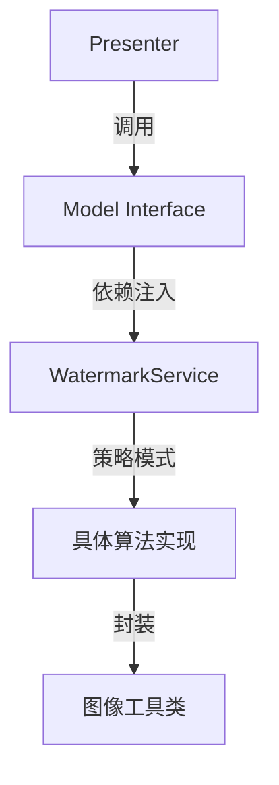

model 层的以下方法是对图片进行操作的，最终进行的是 io 操作，对输入图像进行处理。该使用接口调用还是直接调用工具函数

```python
    def process_normal_watermark(self, folder,  **kwargs):
        print({"folder":folder,**{param: data for param, data in kwargs.items()}})

    def process_foggy_watermark(self, folder, text="BH", **kwargs):
        print({"folder":folder,**{param: data for param, data in kwargs.items()}})
```

----R1

```ys_think

<icon>https://wy-static.wenxiaobai.com/bot-capability/prod/%E6%B7%B1%E5%BA%A6%E6%80%9D%E8%80%83.png</icon>

<start>思考中...</start>

好的，我需要帮助用户决定在模型层（model层）处理图片时，是使用接口调用还是直接调用工具函数。用户提供了两个方法，process_normal_watermark和process_foggy_watermark，这两个方法目前只是打印参数，但实际需要进行IO操作处理图片。用户的问题是关于如何设计这些方法的实现方式，是应该通过接口调用还是直接调用工具函数。

首先，我需要理解用户的问题背景。用户可能在开发一个图像处理应用，涉及到不同的水印处理方式，比如普通水印和雾化水印。model层负责具体的业务逻辑，这里需要处理图片，包括读取、修改和保存。用户关心的是如何组织代码结构，使得model层的方法既高效又符合良好的设计原则。

接下来，我需要考虑两种选择的优缺点。直接调用工具函数可能更简单快捷，但接口调用可能提供更好的解耦和扩展性。用户提到的方法目前只是打印参数，但未来需要实际处理图像，所以需要考虑代码的可维护性和可扩展性。

接口调用的优势在于抽象层次高，可以定义统一的接口，让不同的处理方式实现该接口，这样model层的方法只需要调用接口，而不需要关心具体实现。这符合依赖倒置原则，降低了模块间的耦合度。例如，可以定义一个WatermarkProcessor接口，包含apply_watermark方法，不同的水印处理类实现这个接口。这样，当新增一种水印处理方式时，只需添加新的实现类，而不需要修改model层的代码。

直接调用工具函数可能适用于简单场景，比如工具函数是静态方法或模块级函数，直接处理传入的参数。这种方式代码量少，结构简单，但缺乏灵活性。如果未来需要替换处理逻辑或增加新功能，可能需要修改model层的方法，违反了开闭原则。

用户提供的代码中，process_normal_watermark和process_foggy_watermark的参数结构相似，但处理逻辑不同。这说明可能存在多个处理策略，适合使用策略模式，通过接口来统一调用不同的策略。例如，将每种水印处理方式封装成一个策略类，model层根据传入的参数选择合适的策略执行。

另外，考虑到图像处理可能涉及IO操作，如读取文件、保存结果，这些操作可能需要错误处理、资源管理等。如果使用接口，可以将这些通用逻辑封装在基类或工具函数中，提高代码复用性。例如，基类处理文件的读取和保存，子类专注于水印算法的实现。

还需要考虑单元测试的便利性。通过接口调用，可以更容易地使用模拟对象（mock）来替换实际的水印处理类，从而隔离测试model层的逻辑，而不需要实际执行IO操作。

用户提到的工具函数可能是指现有的图像处理库，比如Pillow的函数。在这种情况下，直接调用这些函数可能会让代码更直接，但将调用封装在接口后面可以隔离第三方库的变化对业务逻辑的影响。如果未来需要更换图像处理库，只需修改接口的实现，而不需要改动model层。

总结下来，使用接口调用的方式更符合良好的软件设计原则，尤其是当系统需要支持多种处理方式，且希望保持代码的可扩展性和可维护性时。直接调用工具函数可能在简单场景下更高效，但在复杂或可能变化的场景中，接口提供更好的灵活性。

因此，建议用户采用接口调用的方式，定义统一的水印处理接口，将不同的处理逻辑封装成实现该接口的类。model层的方法根据参数选择对应的处理类实例，并调用其方法执行具体的处理。这样，代码结构更清晰，扩展性更强，也便于测试和维护。

<end>已深度思考（用时25秒）</end>

```

针对图像处理操作的设计选择，以下是经过优化的方案建议：

### **分层架构设计**



### **方案对比分析**

| 维度           | 直接调用工具函数           | 接口调用策略模式       |
| -------------- | -------------------------- | ---------------------- |
| **耦合度**     | 高耦合，模型层依赖具体实现 | 低耦合，依赖抽象接口   |
| **扩展性**     | 新增算法需修改模型层       | 新增策略类即可扩展     |
| **测试便利性** | 需 Mock 文件系统           | 可 Mock 接口实现       |
| **代码复用**   | 重复 IO 操作代码           | 统一基类处理 IO        |
| **维护成本**   | 修改影响范围大             | 局部修改不影响其他模块 |

### **推荐方案实现**

#### **1. 定义核心接口**

```python
from abc import ABC, abstractmethod
from pathlib import Path
from typing import Dict

class IWatermarkProcessor(ABC):
    @abstractmethod
    def process(self, image_path: Path, params: Dict) -> Path:
        """返回处理后的文件路径"""

    @property
    @abstractmethod
    def output_dir(self) -> str:
        """输出目录名称"""
```

#### **2. 实现具体策略**

```python
class NormalWatermarkProcessor(IWatermarkProcessor):
    @property
    def output_dir(self):
        return "normal_output"

    def process(self, image_path, params):
        output_path = self._get_output_path(image_path)
        # 调用工具函数的具体实现
        apply_normal_watermark(
            src_path=image_path,
            dest_path=output_path,
            opacity=params['opacity']
        )
        return output_path

    def _get_output_path(self, image_path):
        return image_path.parent / self.output_dir / image_path.name
```

#### **3. 工具函数封装**

```python
# 在独立模块 image_utils.py 中
def apply_normal_watermark(src_path: Path, dest_path: Path, opacity: float):
    """具体实现细节隔离在此"""
    with Image.open(src_path) as img:
        # 实际处理逻辑
        img = process_image_opacity(img, opacity)
        img.save(dest_path)
```

#### **4. Model 层调用**

```python
class WatermarkModel:
    def __init__(self):
        self._processors = {
            'normal': NormalWatermarkProcessor(),
            'foggy': FoggyWatermarkProcessor()
        }

    def process(self, wm_type: str, folder: Path, params: Dict):
        processor = self._processors[wm_type]
        output_files = []

        for img_file in folder.glob('*.jpg'):
            try:
                output_path = processor.process(img_file, params)
                output_files.append(output_path)
            except ImageProcessingError as e:
                logger.error(f"处理失败: {img_file.name} - {str(e)}")

        return output_files
```

### **关键设计决策**

1. **接口隔离原则**

   - 每个水印类型对应独立处理器
   - 新增水印类型只需添加`IWatermarkProcessor`实现

2. **IO 统一管理**

   ```python
   class BaseWatermarkProcessor(IWatermarkProcessor):
       def _ensure_output_dir(self, image_path):
           output_dir = image_path.parent / self.output_dir
           output_dir.mkdir(exist_ok=True)
   ```

3. **异常处理策略**

   ```python
   class ImageProcessingError(Exception):
       """自定义异常基类"""

   class InvalidImageError(ImageProcessingError):
       """无效图片异常"""
   ```

4. **异步扩展支持**
   ```python
   async def process_async(self, executor):
       loop = asyncio.get_event_loop()
       return await loop.run_in_executor(executor, self.process)
   ```

### **性能优化建议**

1. **内存管理**

   ```python
   def process_large_image(src, dest):
       """流式处理大文件"""
       with open(src, 'rb') as f_src, open(dest, 'wb') as f_dest:
           for chunk in read_image_chunks(f_src):
               processed = process_chunk(chunk)
               f_dest.write(processed)
   ```

2. **缓存机制**

   ```python
   from functools import lru_cache

   @lru_cache(maxsize=100)
   def load_watermark_template(path):
       return np.load(path)
   ```

该方案通过接口策略模式实现了：

- 业务逻辑与具体实现的解耦
- 可测试性的显著提升
- 可扩展的架构设计
- 统一的错误处理机制
- 性能优化空间

建议根据实际项目规模选择适当复杂度，小型项目可简化接口层级，大型项目可进一步拆分为独立服务。
