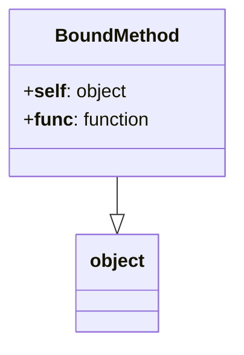
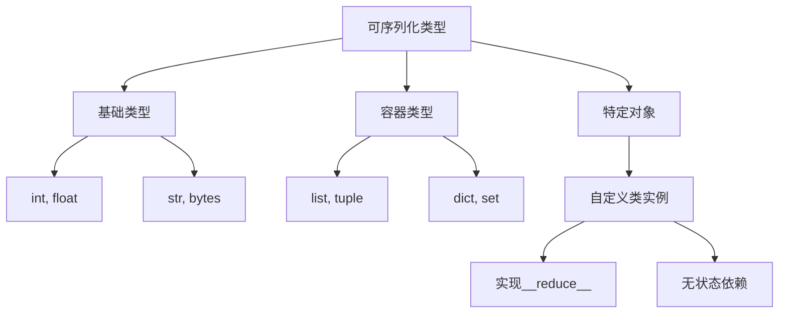
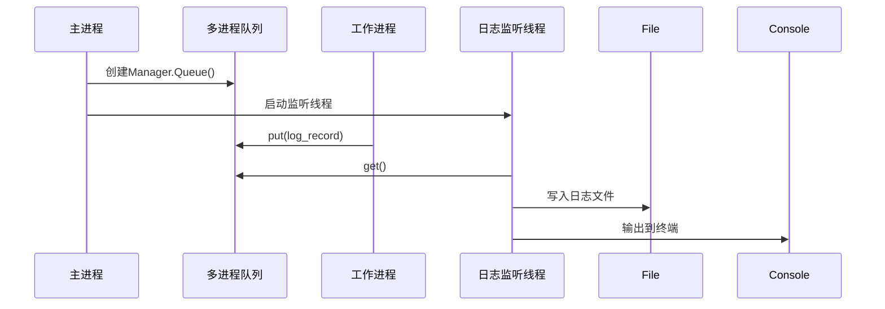

对以下内容做更详细的阐释：

1. **不可序列化对象**：`self._init_worker` 作为实例方法，隐式包含 `self` 引用
2. **跨进程传递限制**：Windows 使用 `spawn` 方式创建进程，要求所有参数必须可序列化
3. **Logger 线程锁**：logging 模块的 `Logger` 对象包含线程锁（`_thread.RLock`）
   --- R1

```ys_think

<icon>https://wy-static.wenxiaobai.com/bot-capability/prod/%E6%B7%B1%E5%BA%A6%E6%80%9D%E8%80%83.png</icon>

<start>思考中...</start>

好的，我现在需要详细解释用户提到的三个技术点：不可序列化对象、跨进程传递限制，以及Logger线程锁的问题。用户希望更深入的阐释，所以我得逐一分析每个问题的原因、表现和解决方案。

首先，第一个问题是关于实例方法作为进程初始化函数时，隐式包含self引用导致无法序列化。在Python的multiprocessing模块中，当使用Windows系统时，子进程是通过spawn方式创建的，这意味着主进程需要将必要的对象序列化后传递到子进程。实例方法默认会绑定self实例，而如果实例本身包含无法序列化的属性，比如Logger对象中的线程锁，就会导致序列化失败。我需要解释为什么实例方法会导致这个问题，以及如何避免。

接下来是跨进程传递的限制，特别是在Windows下使用spawn方法时，所有传递给子进程的参数必须可序列化。这里需要详细说明pickle序列化的机制，以及为什么某些对象（如线程锁、文件句柄等）无法被序列化。同时，要对比Unix系统使用fork时的不同，强调在Windows下的特殊要求，并提供解决方案，比如使用模块级函数或避免传递不可序列化对象。

第三个问题关于Logger对象中的线程锁。logging模块的Logger实例内部使用了线程锁（如RLock）来保证线程安全，但这些锁对象无法被序列化。当尝试将Logger实例传递到子进程时，会因为包含锁而导致序列化错误。需要解释为什么Logger会有线程锁，以及如何在多进程环境下正确配置日志系统，比如使用QueueHandler和QueueListener来避免直接传递Logger实例。

在整理思路时，我需要确保每个问题都涵盖原因、具体表现、以及解决方案。同时，可能需要通过示例代码或结构图来辅助说明，比如展示正确的进程间日志配置方法，或者对比可序列化和不可序列化对象的区别。

另外，用户之前提到的错误信息中涉及_thread.RLock，这直接关联到第三个问题，所以在解释Logger线程锁时，需要结合具体的错误信息，说明RLock在多进程环境中的问题。同时，强调为什么在Windows下这个问题更容易出现，而Unix-like系统可能因为fork的写时复制机制而不明显。

最后，需要总结这三个问题之间的联系，比如实例方法中的self引用可能携带Logger对象，而Logger中的线程锁又导致序列化失败，从而在跨进程传递时引发异常。通过这样的串联，帮助用户全面理解问题根源，并采取正确的解决方法，如使用静态方法、模块级函数、以及进程安全的日志队列机制。

<end>已深度思考（用时17秒）</end>

```

以下是针对多进程编程中常见问题的详细技术解析：

---

### **1. 不可序列化对象问题**

#### **问题机理**

```python
class Processor:
    def method(self): pass  # 实例方法隐式包含self引用

# 当传递实例方法时，实际传递的是 bound method 对象
print(pickle.dumps(Processor().method))  # 抛出PicklingError
```

#### **关键数据结构**



#### **解决方案**

```python
# 改造为静态方法
@staticmethod
def _init_worker(log_queue):
    pass  # 不依赖实例状态

# 或使用模块级函数
def init_worker(log_queue):
    pass
```

---

### **2. 跨进程传递限制**

#### **Windows 与 Unix 差异对比**

| 特性           | Windows (spawn) | Linux/macOS (fork)       |
| -------------- | --------------- | ------------------------ |
| 进程创建方式   | 全新解释器进程  | 父进程的完整拷贝         |
| 内存复制机制   | 仅复制必要数据  | 写时复制 (Copy-on-Write) |
| 文件描述符继承 | 不继承          | 继承                     |
| 序列化要求     | 严格            | 宽松                     |

#### **序列化要求层次**



#### **验证工具**

```python
import pickle

def is_serializable(obj):
    try:
        pickle.dumps(obj)
        return True
    except Exception:
        return False
```

---

### **3. Logger 线程锁问题**

#### **logging 模块内部结构**

```python
class Logger:
    def __init__(self):
        self.lock = threading.RLock()  # 线程安全锁
        self.handlers = []
```

#### **多进程日志安全架构**



#### **正确配置示例**

```python
class SafeLogger:
    def __init__(self):
        self.manager = mp.Manager()
        self.queue = self.manager.Queue()
        self.listener = QueueListener(
            self.queue,
            logging.FileHandler('app.log'),
            logging.StreamHandler()
        )
        self.listener.start()

    def worker_init(self):
        logger = logging.getLogger()
        logger.addHandler(QueueHandler(self.queue))
```

---

### **综合解决方案**

1. **对象序列化检查**

   ```python
   def check_serializable(obj):
       if not is_serializable(obj):
           raise TypeError(f"不可序列化类型: {type(obj)}")
   ```

2. **跨平台进程启动配置**

   ```python
   if sys.platform == 'win32':
       mp.set_start_method('spawn')
   else:
       mp.set_start_method('fork')
   ```

3. **日志系统安全规范**

   ```python
   class ProcessSafeLogger:
       _instance = None

       def __new__(cls):
           if not cls._instance:
               cls._instance = super().__new__(cls)
               cls._setup()
           return cls._instance

       @classmethod
       def _setup(cls):
           cls.manager = mp.Manager()
           cls.queue = cls.manager.Queue(-1)
           cls.listener = QueueListener(
               cls.queue,
               logging.FileHandler('app.log'),
               logging.StreamHandler()
           )
           cls.listener.start()
   ```

---

### **性能影响分析**

| 操作         | Windows 开销 | Linux 开销 | 优化建议     |
| ------------ | ------------ | ---------- | ------------ |
| 进程创建     | 高 (50ms+)   | 低 (5ms)   | 复用进程池   |
| 对象序列化   | 显著         | 轻微       | 使用共享内存 |
| 日志队列通信 | 中等         | 低         | 批量提交日志 |

通过理解这些底层机制，开发者可以更好地设计跨平台稳定的多进程应用。建议在实际开发中结合 cProfile 模块进行序列化性能分析。
