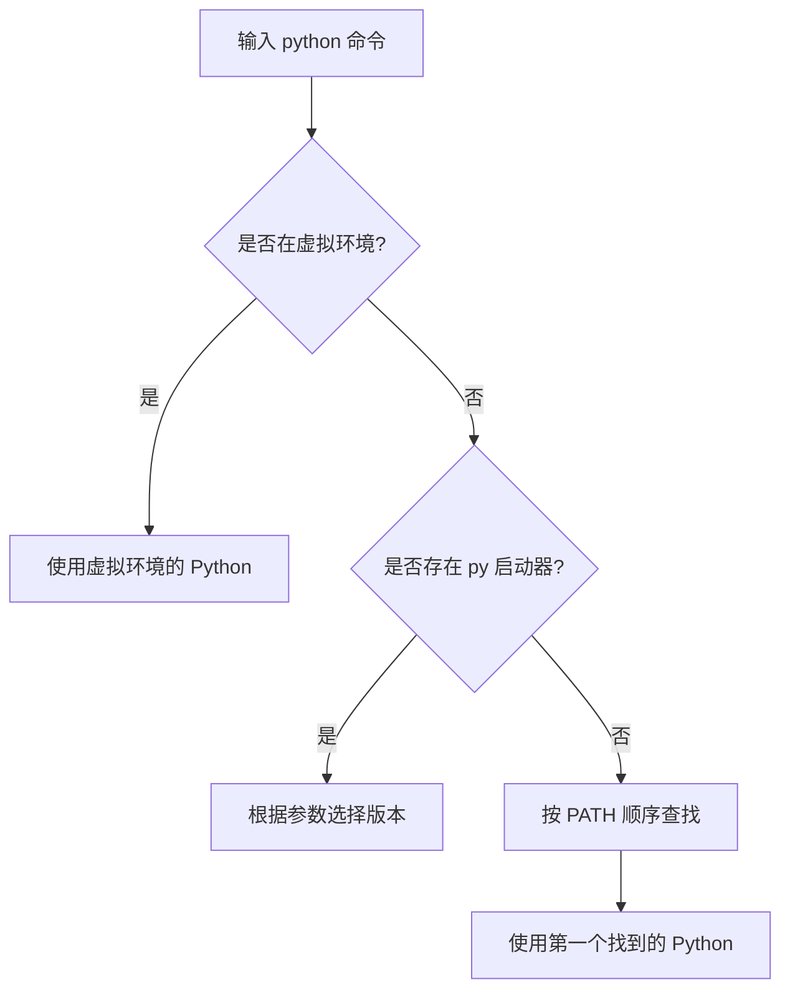

在 Windows 系统中，Python 解释器的选择机制由多个因素共同决定，以下是关键要素的详细说明：

### 一、核心选择机制




### 二、安装路径类型

| 安装方式        | 默认路径示例                                                     |
| --------------- | ---------------------------------------------------------------- |
| 官网安装程序    | `C:\Python39` 或 `C:\Users\<用户>\AppData\Local\Programs\Python` |
| Microsoft Store | `C:\Users\<用户>\AppData\Local\Microsoft\WindowsApps`            |
| Anaconda        | `C:\Users\<用户>\Anaconda3`                                      |
| 自定义安装      | 用户指定的任意路径                                               |

### 三、环境变量配置

1. **PATH 环境变量优先级**

   ```powershell
   # 查看当前 PATH 顺序
   $env:Path -split ';'
   ```

   - 系统按 PATH 列表顺序查找 `python.exe`
   - 找到的第一个有效路径会被使用

2. **手动验证路径顺序**
   ```powershell
   where python
   # 示例输出：
   # C:\Users\user\venv\Scripts\python.exe
   # C:\Python39\python.exe
   # C:\Users\user\AppData\Local\Microsoft\WindowsApps\python.exe
   ```

### 四、版本管理工具

| 工具          | 命令示例                          | 功能说明             |
| ------------- | --------------------------------- | -------------------- |
| Python 启动器 | `py -3.10`                        | 选择特定版本         |
|               | `py -0`                           | 列出所有已安装版本   |
| Conda         | `conda create -n py39 python=3.9` | 创建 Python 3.9 环境 |

### 五、虚拟环境机制

```powershell
# 创建虚拟环境
python -m venv .venv

# 激活环境（PowerShell）
.\.venv\Scripts\Activate.ps1

# 验证路径
(Get-Command python).Path
# 输出示例: C:\project\.venv\Scripts\python.exe
```

### 六、IDE 配置示例

1. **VSCode 配置**
   ```json
   // .vscode/settings.json
   {
     "python.defaultInterpreterPath": "C:\\Python39\\python.exe"
   }
   ```
2. **PyCharm 配置**
   - 路径：`File > Settings > Project: <name> > Python Interpreter`

### 七、常见问题排查

1. **版本冲突**
   ```powershell
   # 强制指定版本
   python3.9 -V
   ```
2. **修复 PATH 环境变量**

   ```powershell
   # 手动添加 Python 到 PATH
   [Environment]::SetEnvironmentVariable("Path", "$env:Path;C:\Python39", "User")
   ```

3. **注册表查看**
   ```powershell
   # 查看注册安装信息
   reg query HKLM\SOFTWARE\Python
   ```

### 八、最佳实践建议

1. 使用虚拟环境隔离项目依赖
2. 优先使用 `py` 启动器管理多版本
3. 在 IDE 中显式指定解释器路径
4. 避免将多个 Python 版本同时加入 PATH

通过以上机制，Windows 系统会根据环境变量、虚拟环境状态和工具配置智能选择解释器路径。理解这些层级关系可有效解决版本冲突问题。

以下是在 PyCharm 中打包 Python 程序为 EXE 文件的详细步骤指南：

### 一、使用 PyInstaller 打包（推荐方案）

#### 1. 安装 PyInstaller

```bash
# 在 PyCharm 终端执行
pip install pyinstaller
```

#### 2. 配置打包参数

```python
# 在项目根目录创建 build.spec 文件
# 示例配置（可自定义图标和资源文件）
a = Analysis(
    ['main.py'],  # 主程序入口
    pathex=[],     # 项目路径
    binaries=[],
    datas=[('assets/*', 'assets')],  # 资源文件
    hiddenimports=[],  # 解决模块未找到问题
    hookspath=[],
    runtime_hooks=[],
    excludes=[],
    win_no_prefer_redirects=False,
    win_private_assemblies=False,
    cipher=None,
    noarchive=False
)
exe = EXE(
    a,
    name='MyApp',  # 输出名称
    icon='icon.ico',  # 程序图标
    debug=False,
    bootloader_ignore_signals=False,
    strip=False,
    upx=True,  # 压缩可执行文件
    console=False  # 是否显示控制台窗口
)
```

#### 3. 执行打包命令

```bash
# 方式1：直接打包
pyinstaller --noconsole --onefile --icon=icon.ico main.py

# 方式2：使用 spec 文件
pyinstaller build.spec
```

### 二、进阶配置（解决常见问题）

#### 1. 添加数据文件

```python
# 在 spec 文件中添加：
datas=[ ('images/*.png', 'images'),
        ('config/*.json', 'config') ]
```

#### 2. 处理动态导入

```python
hiddenimports=[
    'sklearn.utils._weight_vector',
    'pandas._libs.tslibs.np_datetime'
]
```

#### 3. 减少文件体积

```bash
# 安装 UPX 压缩工具
# 下载地址：https://upx.github.io/
# 配置到 spec 文件：
upx_dir='C:/path/to/upx'
```

### 三、打包后文件结构

```
dist/
├── MyApp.exe          # 生成的可执行文件
build/
└── MyApp/            # 临时构建文件
```

### 四、验证打包结果

1. 在 `dist` 目录双击运行 EXE 文件
2. 使用 Dependency Walker 检查依赖：
   ```bash
   pip install depends
   depends MyApp.exe
   ```

### 五、常见问题解决方案

| 问题现象       | 解决方案                          |
| -------------- | --------------------------------- |
| 缺少 DLL 文件  | 手动复制到 EXE 同级目录           |
| 图标未生效     | 使用 256x256 像素 .ico 格式文件   |
| 文件体积过大   | 启用 UPX 压缩，排除无用依赖       |
| 防病毒软件误报 | 申请代码签名证书（推荐 DigiCert） |

### 六、替代方案对比

| 工具        | 优点                   | 缺点               |
| ----------- | ---------------------- | ------------------ |
| PyInstaller | 支持跨平台，单文件打包 | 文件体积较大       |
| cx_Freeze   | 官方推荐，兼容性好     | 配置复杂           |
| Nuitka      | 编译成 C，性能提升     | 打包时间较长       |
| py2exe      | 老牌工具，稳定         | 不支持 Python 3.8+ |

### 七、专业建议

1. 使用虚拟环境打包：

```bash
python -m venv venv
venv\Scripts\activate
pip install -r requirements.txt
```

2. 版本兼容性处理：

```python
# 在代码开头添加版本检查
import sys
if not sys.version_info >= (3, 8):
    print("需要 Python 3.8 或更高版本")
    sys.exit(1)
```

3. 制作安装包：

```bash
# 使用 Inno Setup 创建安装程序
pip install innounp
iscc setup.iss
```

通过以上步骤，可以在 PyCharm 中高效完成 EXE 打包工作。建议优先使用 PyInstaller + spec 文件的组合方案，既保证灵活性又便于维护。

在 Windows 系统中修改 Python 注册表需要谨慎操作，以下是专业级操作指南：

### 一、注册表定位路径

```powershell
# Python核心注册表路径
HKEY_LOCAL_MACHINE\SOFTWARE\Python\PythonCore

# 用户级安装路径（Microsoft Store安装方式）
HKEY_CURRENT_USER\Software\Python\PythonCore

# 第三方发行版路径（如Anaconda）
HKEY_LOCAL_MACHINE\SOFTWARE\Python\ContinuumAnalytics
```

### 二、关键注册表项解析

| 键值路径                    | 数据类型 | 示例值                           | 作用说明     |
| --------------------------- | -------- | -------------------------------- | ------------ |
| \PythonCore\3.9\InstallPath | REG_SZ   | C:\Python39\                     | 主安装目录   |
| \PythonCore\3.9\PythonPath  | REG_SZ   | C:\Python39\Lib;C:\Python39\DLLs | 模块搜索路径 |
| \PythonCore\3.9\DisplayName | REG_SZ   | Python 3.9 (64-bit)              | 显示名称     |
| \PythonCore\3.9\SysVersion  | REG_SZ   | 3.9                              | 系统识别版本 |

### 三、安全修改流程

#### 1. 备份注册表

```powershell
# 导出Python相关注册表项
reg export "HKLM\SOFTWARE\Python" python_backup.reg /y
reg export "HKCU\Software\Python" python_user_backup.reg /y
```

#### 2. 修改安装路径示例

```powershell
# 使用PowerShell修改（需管理员权限）
$pythonPath = "C:\NewPythonPath\"
$version = "3.10"

# 修改核心路径
Set-ItemProperty -Path "HKLM:\SOFTWARE\Python\PythonCore\$version\InstallPath" -Name "(Default)" -Value $pythonPath

# 更新PythonPath
$pythonPaths = @("$pythonPath\Lib", "$pythonPath\DLLs") -join ";"
Set-ItemProperty -Path "HKLM:\SOFTWARE\Python\PythonCore\$version\PythonPath" -Name "(Default)" -Value $pythonPaths
```

#### 3. 注册表权限配置

```powershell
# 获取注册表项权限
$acl = Get-Acl "HKLM:\SOFTWARE\Python"
$rule = New-Object System.Security.AccessControl.RegistryAccessRule("Users","FullControl","Allow")
$acl.AddAccessRule($rule)
Set-Acl -Path "HKLM:\SOFTWARE\Python" -AclObject $acl
```

### 四、调试与验证方法

#### 1. 检查注册表影响

```python
import winreg
import sys

def check_registry():
    try:
        key = winreg.OpenKey(winreg.HKEY_LOCAL_MACHINE, r"SOFTWARE\Python\PythonCore")
        version = winreg.EnumKey(key, 0)
        subkey = winreg.OpenKey(key, f"{version}\\InstallPath")
        path = winreg.QueryValue(subkey, None)
        print(f"Registry Path: {path}")
        print(f"Actual Path: {sys.exec_prefix}")
    except Exception as e:
        print(f"Error: {str(e)}")
```

#### 2. 路径对比验证

```powershell
# 注册表路径
$regPath = (Get-ItemProperty "HKLM:\SOFTWARE\Python\PythonCore\3.10\InstallPath")."(Default)"

# 实际执行路径
$actualPath = (where python).Split('\')[0..3] -join '\'

# 比较结果
if ($regPath -ne $actualPath) {
    Write-Warning "路径不一致！注册表：$regPath | 实际：$actualPath"
}
```

### 五、常见问题解决方案

#### 1. 多版本冲突修复

```powershell
# 清理旧版本残留
Get-ChildItem "HKLM:\SOFTWARE\Python\PythonCore" | ForEach-Object {
    $ver = $_.PSChildName
    if ($ver -notmatch "^\d+\.\d+$") { return }
    $path = (Get-ItemProperty $_.PSPath)."(Default)"
    if (-not (Test-Path $path)) {
        Remove-Item -Path $_.PSPath -Recurse -Force
    }
}
```

#### 2. 虚拟环境注册

```powershell
# 注册虚拟环境到系统
$venvPath = "C:\Project\.venv"
New-Item -Path "HKCU:\Software\Python\PythonCore\3.10\venv" -Force | Out-Null
Set-ItemProperty -Path "HKCU:\Software\Python\PythonCore\3.10\venv" -Name "(Default)" -Value $venvPath
```

### 六、自动化管理脚本

```powershell
# 自动修复注册表配置
function Repair-PythonRegistry {
    param(
        [Parameter(Mandatory=$true)]
        [ValidateScript({Test-Path $_})]
        [string]$PythonPath
    )

    $version = (Get-Item "$PythonPath\python.exe").VersionInfo.ProductVersion.Split('.')[0,1] -join '.'

    $regPath = "HKLM:\SOFTWARE\Python\PythonCore\$version"
    if (-not (Test-Path $regPath)) {
        New-Item -Path $regPath -Force | Out-Null
    }

    $props = @{
        "InstallPath" = $PythonPath
        "PythonPath"  = "$PythonPath\Lib;$PythonPath\DLLs"
        "DisplayName" = "Python $version (Custom)"
        "SysVersion"   = $version
    }

    foreach ($key in $props.Keys) {
        Set-ItemProperty -Path $regPath -Name $key -Value $props[$key]
    }

    Write-Host "注册表修复完成" -ForegroundColor Green
}
```

### 七、风险控制措施

1. **操作前准备**

   ```powershell
   # 创建系统还原点
   Checkpoint-Computer -Description "Before Python Registry Modification"
   ```

2. **操作后验证**
   ```powershell
   # 检查注册表完整性
   Get-ItemProperty "HKLM:\SOFTWARE\Python\PythonCore\*\InstallPath" |
   Select-Object PSChildName, @{n="Path";e={$_."(default)"}}
   ```

建议优先使用 Python 官方安装程序维护注册表项，非必要不手动修改注册表。对于开发环境建议使用虚拟环境管理工具（如 `conda` 或 `virtualenv`）来避免系统级修改。
